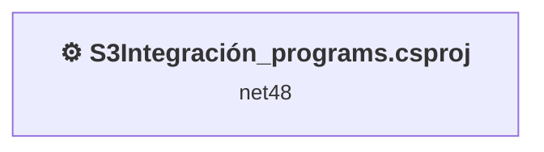
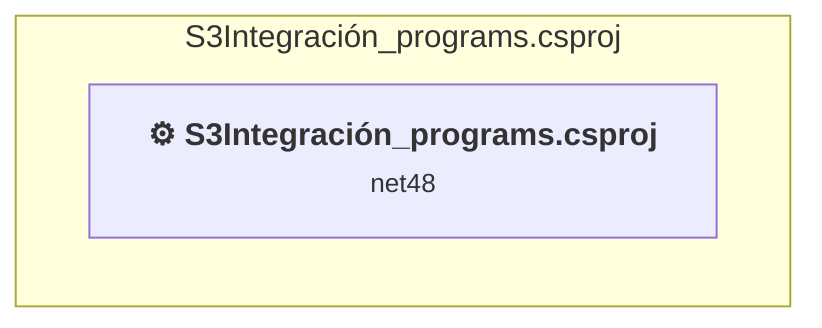

# Projects and dependencies analysis

This document provides a comprehensive overview of the projects and their dependencies in the context of upgrading to .NETCoreApp,Version=v10.0.

## Table of Contents

- [Executive Summary](#executive-Summary)
  - [Highlevel Metrics](#highlevel-metrics)
  - [Projects Compatibility](#projects-compatibility)
  - [Package Compatibility](#package-compatibility)
  - [API Compatibility](#api-compatibility)
- [Aggregate NuGet packages details](#aggregate-nuget-packages-details)
- [Top API Migration Challenges](#top-api-migration-challenges)
  - [Technologies and Features](#technologies-and-features)
  - [Most Frequent API Issues](#most-frequent-api-issues)
- [Projects Relationship Graph](#projects-relationship-graph)
- [Project Details](#project-details)

  - [S3Integración_programs.csproj](#s3integración_programscsproj)

## Executive Summary

### Highlevel Metrics

| Metric | Count | Status |
| :--- | :---: | :--- |
| Total Projects | 1 | All require upgrade |
| Total NuGet Packages | 0 | All compatible |
| Total Code Files | 20 |  |
| Total Code Files with Incidents | 17 |  |
| Total Lines of Code | 7421 |  |
| Total Number of Issues | 5763 |  |
| Estimated LOC to modify | 5761+ | at least 77.6% of codebase |

### Projects Compatibility

| Project | Target Framework | Difficulty | Package Issues | API Issues | Est. LOC Impact | Description |
| :--- | :---: | :---: | :---: | :---: | :---: | :--- |
| [S3Integración_programs.csproj](#s3integración_programscsproj) | net48 | 🟡 Medium | 0 | 5761 | 5761+ | ClassicWinForms, Sdk Style = False |

### Package Compatibility

| Status | Count | Percentage |
| :--- | :---: | :---: |
| ✅ Compatible | 0 | 0.0% |
| ⚠️ Incompatible | 0 | 0.0% |
| 🔄 Upgrade Recommended | 0 | 0.0% |
| ***Total NuGet Packages*** | ***0*** | ***100%*** |

### API Compatibility

| Category | Count | Impact |
| :--- | :---: | :--- |
| 🔴 Binary Incompatible | 5718 | High - Require code changes |
| 🟡 Source Incompatible | 42 | Medium - Needs re-compilation and potential conflicting API error fixing |
| 🔵 Behavioral change | 1 | Low - Behavioral changes that may require testing at runtime |
| ✅ Compatible | 10729 |  |
| ***Total APIs Analyzed*** | ***16490*** |  |

## Aggregate NuGet packages details

| Package | Current Version | Suggested Version | Projects | Description |
| :--- | :---: | :---: | :--- | :--- |

## Top API Migration Challenges

### Technologies and Features

| Technology | Issues | Percentage | Migration Path |
| :--- | :---: | :---: | :--- |
| Windows Forms | 5708 | 99.1% | Windows Forms APIs for building Windows desktop applications with traditional Forms-based UI that are available in .NET on Windows. Enable Windows Desktop support: Option 1 (Recommended): Target net9.0-windows; Option 2: Add <UseWindowsDesktop>true</UseWindowsDesktop>; Option 3 (Legacy): Use Microsoft.NET.Sdk.WindowsDesktop SDK. |
| GDI+ / System.Drawing | 40 | 0.7% | System.Drawing APIs for 2D graphics, imaging, and printing that are available via NuGet package System.Drawing.Common. Note: Not recommended for server scenarios due to Windows dependencies; consider cross-platform alternatives like SkiaSharp or ImageSharp for new code. |
| Legacy Configuration System | 2 | 0.0% | Legacy XML-based configuration system (app.config/web.config) that has been replaced by a more flexible configuration model in .NET Core. The old system was rigid and XML-based. Migrate to Microsoft.Extensions.Configuration with JSON/environment variables; use System.Configuration.ConfigurationManager NuGet package as interim bridge if needed. |

### Most Frequent API Issues

| API | Count | Percentage | Category |
| :--- | :---: | :---: | :--- |
| T:System.Windows.Forms.TableLayoutPanel | 532 | 9.2% | Binary Incompatible |
| T:System.Windows.Forms.RadioButton | 338 | 5.9% | Binary Incompatible |
| T:System.Windows.Forms.FlowLayoutPanel | 333 | 5.8% | Binary Incompatible |
| T:System.Windows.Forms.Button | 298 | 5.2% | Binary Incompatible |
| T:System.Windows.Forms.DockStyle | 225 | 3.9% | Binary Incompatible |
| T:System.Windows.Forms.Label | 178 | 3.1% | Binary Incompatible |
| T:System.Windows.Forms.GroupBox | 156 | 2.7% | Binary Incompatible |
| P:System.Windows.Forms.Control.Name | 150 | 2.6% | Binary Incompatible |
| P:System.Windows.Forms.Control.Size | 149 | 2.6% | Binary Incompatible |
| P:System.Windows.Forms.Control.TabIndex | 141 | 2.4% | Binary Incompatible |
| P:System.Windows.Forms.Control.Location | 141 | 2.4% | Binary Incompatible |
| T:System.Windows.Forms.TextBox | 100 | 1.7% | Binary Incompatible |
| T:System.Windows.Forms.TableLayoutControlCollection | 84 | 1.5% | Binary Incompatible |
| P:System.Windows.Forms.TableLayoutPanel.Controls | 84 | 1.5% | Binary Incompatible |
| M:System.Windows.Forms.TableLayoutControlCollection.Add(System.Windows.Forms.Control,System.Int32,System.Int32) | 84 | 1.5% | Binary Incompatible |
| T:System.Windows.Forms.SizeType | 78 | 1.4% | Binary Incompatible |
| F:System.Windows.Forms.DockStyle.Fill | 75 | 1.3% | Binary Incompatible |
| P:System.Windows.Forms.Control.Dock | 75 | 1.3% | Binary Incompatible |
| T:System.Windows.Forms.Control.ControlCollection | 73 | 1.3% | Binary Incompatible |
| P:System.Windows.Forms.Control.Controls | 73 | 1.3% | Binary Incompatible |
| M:System.Windows.Forms.Control.ControlCollection.Add(System.Windows.Forms.Control) | 73 | 1.3% | Binary Incompatible |
| T:System.Windows.Forms.RowStyle | 73 | 1.3% | Binary Incompatible |
| T:System.Windows.Forms.TableLayoutRowStyleCollection | 73 | 1.3% | Binary Incompatible |
| P:System.Windows.Forms.TableLayoutPanel.RowStyles | 73 | 1.3% | Binary Incompatible |
| M:System.Windows.Forms.TableLayoutRowStyleCollection.Add(System.Windows.Forms.RowStyle) | 73 | 1.3% | Binary Incompatible |
| M:System.Windows.Forms.Control.ResumeLayout(System.Boolean) | 68 | 1.2% | Binary Incompatible |
| M:System.Windows.Forms.Control.SuspendLayout | 68 | 1.2% | Binary Incompatible |
| T:System.Windows.Forms.TabPage | 60 | 1.0% | Binary Incompatible |
| M:System.Windows.Forms.RowStyle.#ctor | 59 | 1.0% | Binary Incompatible |
| T:System.Windows.Forms.Panel | 57 | 1.0% | Binary Incompatible |
| P:System.Windows.Forms.ButtonBase.Text | 55 | 1.0% | Binary Incompatible |
| P:System.Windows.Forms.ButtonBase.AutoSize | 53 | 0.9% | Binary Incompatible |
| M:System.Windows.Forms.Control.PerformLayout | 52 | 0.9% | Binary Incompatible |
| P:System.Windows.Forms.ButtonBase.UseVisualStyleBackColor | 50 | 0.9% | Binary Incompatible |
| T:System.Windows.Forms.ListBox | 50 | 0.9% | Binary Incompatible |
| T:System.Windows.Forms.DialogResult | 49 | 0.9% | Binary Incompatible |
| P:System.Windows.Forms.Panel.AutoSize | 42 | 0.7% | Binary Incompatible |
| T:System.Windows.Forms.Padding | 42 | 0.7% | Binary Incompatible |
| T:System.Windows.Forms.CheckBox | 40 | 0.7% | Binary Incompatible |
| T:System.Windows.Forms.MessageBoxIcon | 38 | 0.7% | Binary Incompatible |
| T:System.Windows.Forms.MessageBoxButtons | 38 | 0.7% | Binary Incompatible |
| P:System.Windows.Forms.TextBox.Text | 35 | 0.6% | Binary Incompatible |
| P:System.Windows.Forms.RadioButton.Checked | 32 | 0.6% | Binary Incompatible |
| F:System.Windows.Forms.SizeType.Percent | 32 | 0.6% | Binary Incompatible |
| T:System.Windows.Forms.ColumnStyle | 32 | 0.6% | Binary Incompatible |
| T:System.Windows.Forms.TableLayoutColumnStyleCollection | 32 | 0.6% | Binary Incompatible |
| P:System.Windows.Forms.TableLayoutPanel.ColumnStyles | 32 | 0.6% | Binary Incompatible |
| M:System.Windows.Forms.TableLayoutColumnStyleCollection.Add(System.Windows.Forms.ColumnStyle) | 32 | 0.6% | Binary Incompatible |
| T:System.Windows.Forms.ComboBox | 32 | 0.6% | Binary Incompatible |
| M:System.Windows.Forms.RadioButton.#ctor | 26 | 0.5% | Binary Incompatible |

## Projects Relationship Graph

Legend:
📦 SDK-style project
⚙️ Classic project

## Project Details

### S3Integración_programs.csproj

#### Project Info

- **Current Target Framework:** net48
- **Proposed Target Framework:** net10.0-windows
- **SDK-style**: False
- **Project Kind:** ClassicWinForms
- **Dependencies**: 0
- **Dependants**: 0
- **Number of Files**: 35
- **Number of Files with Incidents**: 17
- **Lines of Code**: 7421
- **Estimated LOC to modify**: 5761+ (at least 77.6% of the project)

#### Dependency Graph

Legend:
📦 SDK-style project
⚙️ Classic project

### API Compatibility

| Category | Count | Impact |
| :--- | :---: | :--- |
| 🔴 Binary Incompatible | 5718 | High - Require code changes |
| 🟡 Source Incompatible | 42 | Medium - Needs re-compilation and potential conflicting API error fixing |
| 🔵 Behavioral change | 1 | Low - Behavioral changes that may require testing at runtime |
| ✅ Compatible | 10729 |  |
| ***Total APIs Analyzed*** | ***16490*** |  |

#### Project Technologies and Features

| Technology | Issues | Percentage | Migration Path |
| :--- | :---: | :---: | :--- |
| Legacy Configuration System | 2 | 0.0% | Legacy XML-based configuration system (app.config/web.config) that has been replaced by a more flexible configuration model in .NET Core. The old system was rigid and XML-based. Migrate to Microsoft.Extensions.Configuration with JSON/environment variables; use System.Configuration.ConfigurationManager NuGet package as interim bridge if needed. |
| GDI+ / System.Drawing | 40 | 0.7% | System.Drawing APIs for 2D graphics, imaging, and printing that are available via NuGet package System.Drawing.Common. Note: Not recommended for server scenarios due to Windows dependencies; consider cross-platform alternatives like SkiaSharp or ImageSharp for new code. |
| Windows Forms | 5708 | 99.1% | Windows Forms APIs for building Windows desktop applications with traditional Forms-based UI that are available in .NET on Windows. Enable Windows Desktop support: Option 1 (Recommended): Target net9.0-windows; Option 2: Add <UseWindowsDesktop>true</UseWindowsDesktop>; Option 3 (Legacy): Use Microsoft.NET.Sdk.WindowsDesktop SDK. |

