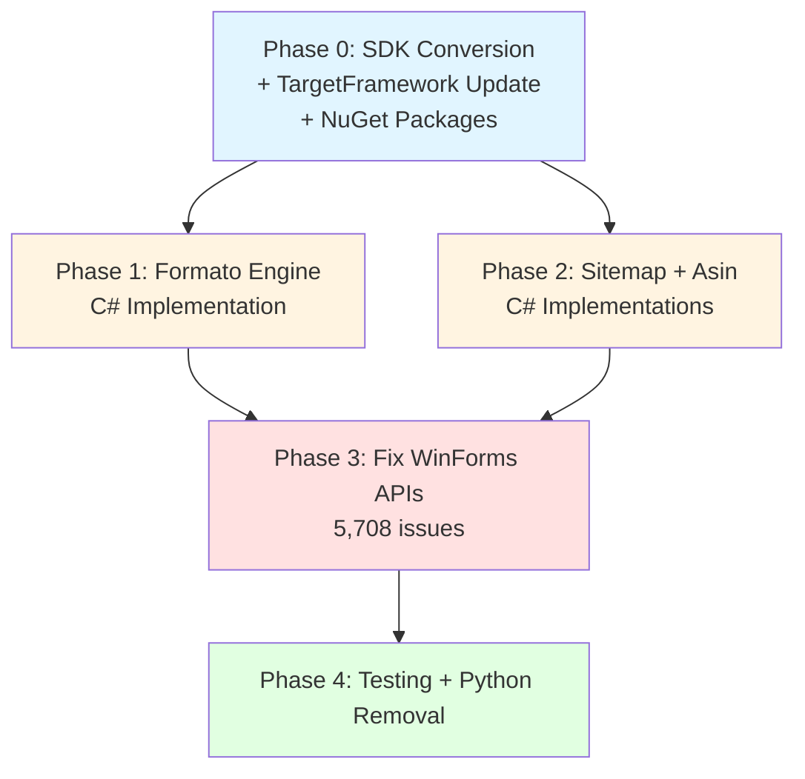
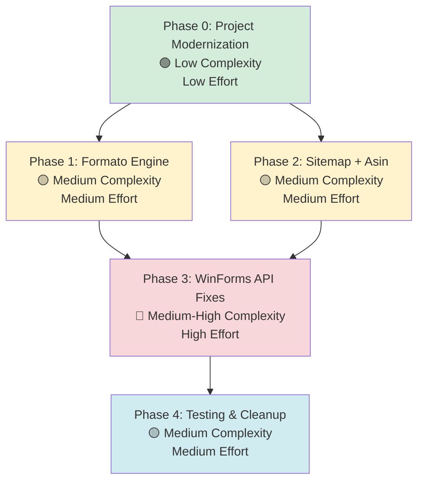

# S3Tools Migration Plan: .NET Framework 4.8 → .NET 10.0 + Python Engine Migration

## Table of Contents

- [Executive Summary](#executive-summary)
- [Migration Strategy](#migration-strategy)
- [Detailed Dependency Analysis](#detailed-dependency-analysis)
- [Python Engine Migration Strategy](#python-engine-migration-strategy)
- [Project-by-Project Plans](#project-by-project-plans)
- [Package Update Reference](#package-update-reference)
- [Breaking Changes Catalog](#breaking-changes-catalog)
- [Risk Management](#risk-management)
- [Testing & Validation Strategy](#testing--validation-strategy)
- [Complexity & Effort Assessment](#complexity--effort-assessment)
- [Source Control Strategy](#source-control-strategy)
- [Success Criteria](#success-criteria)

---

## Executive Summary

### Scenario Description

This migration plan addresses **two critical objectives**:

1. **Framework Migration**: Upgrade from .NET Framework 4.8 to .NET 10.0-windows
2. **Python Engine Elimination**: Migrate all Python engine logic (format.py, form_site.py, engine.py) to native C# implementations

The solution currently consists of a single Windows Forms desktop application with three functional modules (Asin Batcher, Sitemap, Formato), each supported by external Python engines invoked via process execution.

### Scope

**Projects Affected**: 1
- `S3Integración_programs.csproj` (net48 → net10.0-windows)

**Current State**:
- Framework: .NET Framework 4.8
- Architecture: Classic (non-SDK-style) project
- Codebase: 7,421 lines of code
- Python Dependencies: 3 engines (Formato, Sitemap, Asin Batcher)
- UI Technology: Windows Forms
- Current Branch: `MigraciónDotNet`
- Migration Branch: `upgrade-to-NET10`

**Target State**:
- Framework: .NET 10.0-windows (LTS)
- Architecture: SDK-style project
- Codebase: All functionality in C#, zero Python dependencies
- UI Technology: Windows Forms (modern .NET)
- New Capabilities: Direct Visual Studio designer editing for all tabs

### Selected Strategy

**All-At-Once Strategy** - Single coordinated migration combining framework upgrade and Python elimination.

**Rationale**:
- ✅ Single-project solution (simple dependency structure)
- ✅ User requirement: Complete Python elimination, not gradual
- ✅ Starting with Fase 3 (Formato) as pilot, but full migration required
- ✅ C# as default engine with Python fallback during transition already partially implemented (`FormatoEngineClient.cs` shows try/catch pattern)
- ✅ No intermediate multi-targeting complexity needed
- ✅ Clear validation: existing test files in `.\Assets\`

### Complexity Classification

**Medium-High Complexity**

**Discovered Metrics**:
- **Projects**: 1 (simple)
- **Dependency Depth**: 0 (no internal dependencies)
- **Risk Indicators**: 
  - 🔴 High LOC Impact: 5,761+ lines require changes (77.6%)
  - 🟡 API Incompatibility: 5,718 binary incompatible APIs
  - 🟡 Python Migration: 3 engines to reimplement (~800 lines Python → C#)
  - 🟢 No Security Vulnerabilities detected
  - 🟢 No NuGet package conflicts (zero packages currently)
- **Target Technology**: Windows Forms (well-supported in modern .NET)

**Complexity Factors**:
1. **Windows Forms Migration**: 5,708 issues (mostly mechanical, high volume)
2. **Python Logic Migration**: Requires functional equivalence validation
   - Formato: CSV/XLSX header normalization, template matching
   - Sitemap: XML generation, URL processing
   - Asin Batcher: Excel manipulation, duplicate detection
3. **Excel Library Introduction**: ClosedXML integration (user-approved)
4. **Project Structure Change**: Classic → SDK-style

### Critical Issues

**Framework Migration**:
- Convert project to SDK-style format
- Update Windows Forms APIs (5,708 instances)
- Migrate from System.Configuration to Microsoft.Extensions.Configuration
- Add System.Drawing.Common NuGet package (40 GDI+ usages)

**Python Engine Migration** (Priority Order):
1. **Fase 3 - Formato** (`format.py` → `FormatoDotNetEngine.cs`)
   - ✅ Partial stub exists (`FormatoEngineClient.cs` has try/catch fallback pattern)
   - Functions: Header normalization, template detection, CSV/XLSX processing
   - Dependencies: JSON template loading, regex normalization, file encoding detection

2. **Sitemap** (`form_site.py` → `SitemapDotNetEngine.cs`)
   - Functions: Sitemap XML generation, URL validation, template processing

3. **Asin Batcher** (`engine.py` → `AsinBatcherDotNetEngine.cs`)
   - ✅ Client exists (`AsinBatcherEngineClient.cs`)
   - Functions: Excel preview, duplicate export, batch processing

### Recommended Approach

**Phase 0: Prerequisites**
- Convert project to SDK-style
- Update TargetFramework to net10.0-windows
- Add required NuGet packages (ClosedXML, System.Drawing.Common, System.Configuration.ConfigurationManager)

**Phase 1: Formato Engine Migration** (Pilot)
- Implement `FormatoDotNetEngine.cs` with complete parity to `format.py`
- Validate with test files from `.\Assets\`
- Keep Python fallback active

**Phase 2: Sitemap + Asin Batcher Engines**
- Implement both engines in parallel (independent functionality)
- Validate each against production scenarios
- Maintain Python fallbacks

**Phase 3: Windows Forms API Updates**
- Fix compilation errors from framework migration
- Update designer-generated code
- Verify UI rendering and behavior

**Phase 4: Testing & Python Removal**
- Comprehensive validation with all test files
- Performance comparison (C# should be faster)
- Remove Python engine files and fallback code

### Expected Iterations

This plan uses **6 detailed iterations**:
1. ✅ **Skeleton** - Structure created
2. ✅ **Discovery** - Metrics analyzed
3. ✅ **Strategy** - Approach documented
4. **Foundation** - Dependency analysis, migration strategy details
5. **Formato Engine Details** - Detailed implementation plan for Fase 3
6. **Sitemap + Asin Batcher + WinForms Details** - Complete remaining migrations
7. **Risk, Testing, Success Criteria** - Final sections

---

## Migration Strategy

### Approach Selection

**All-At-Once Strategy** with **Functional Phasing**

### Justification

**Why All-At-Once?**
1. **Single Project**: No complex dependency graph to manage
2. **User Requirement**: Complete Python elimination (not gradual), functional parity mandatory
3. **No Intermediate States**: User wants final state = 100% C# in .NET 10, no multi-targeting
4. **Faster Completion**: One migration cycle vs incremental project-by-project
5. **Clean Validation**: Test files in Assets folder provide clear pass/fail criteria

**Why Functional Phasing?**
1. **Risk Management**: Implement one engine at a time, validate before next
2. **Fallback Safety**: Python engines remain active until C# validated
3. **Incremental Progress**: Formato → Sitemap → Asin Batcher allows course correction
4. **Logical Grouping**: Framework changes separate from engine implementations

### Strategy Application

#### Simultaneous Operations (Single Task)

**Phase 0 - Project Modernization** will execute atomically:
- Convert project file to SDK-style
- Update `<TargetFramework>net48</TargetFramework>` → `<TargetFramework>net10.0-windows</TargetFramework>`
- Add `<PackageReference>` elements for ClosedXML, System.Drawing.Common, System.Configuration.ConfigurationManager
- Restore dependencies
- Build (expect compilation errors from API changes)

**Rationale**: These operations are interdependent; cannot test project file without building, cannot build without packages.

#### Sequential Engine Implementations

**Formato → Sitemap → Asin Batcher** (one at a time)

Each engine implementation follows this pattern:
1. Create new C# engine class
2. Migrate Python logic function-by-function
3. Update client class to call C# first, Python fallback on exception
4. Validate with test files
5. Move to next engine

**Rationale**: Allows validation of each engine independently before moving forward.

### Dependency-Based Ordering

**No inter-project dependencies**, but logical execution order:

1. **Phase 0** - Foundation (must complete first)
2. **Phase 1** - Formato (pilot, user priority "Fase 3")
3. **Phase 2** - Sitemap + Asin Batcher (parallel possible)
4. **Phase 3** - Windows Forms API fixes (requires all C# code present)
5. **Phase 4** - Python removal (requires successful testing)

### Parallel vs Sequential Decisions

| Operation | Execution | Reason |
|-----------|-----------|--------|
| Project conversion + framework update + package adds | **Parallel (atomic task)** | Interdependent, tested together |
| Formato implementation | **Sequential** | Pilot phase, learn patterns |
| Sitemap + Asin Batcher implementations | **Can be parallel** | Independent classes, no shared state |
| WinForms API fixes | **Sequential after engines** | Requires all code present to identify full scope |
| Testing + Python removal | **Sequential after compilation** | Requires working build |

### Rollback Strategy

**Git Branch Safety**:
- Source branch: `MigraciónDotNet` (preserved, no changes)
- Work branch: `upgrade-to-NET10` (all changes here)
- Rollback: `git checkout MigraciónDotNet` if needed

**Phase-Level Rollback**:
- Each phase creates logical commit checkpoint
- Can revert individual engine implementations without affecting others
- Python fallback code remains until Phase 4, allowing easy revert

**Validation Gates**:
- Phase 0: Project builds (may have errors, but compiles)
- Phase 1: Formato engine produces identical output to Python for test files
- Phase 2: Sitemap and Asin Batcher produce identical outputs
- Phase 3: Solution builds with zero errors
- Phase 4: All test files pass, Python engines deleted

### Risk Mitigation Principles

1. **Fallback Pattern**: C# engine tries first, Python catches exceptions (already in FormatoEngineClient.cs)
2. **Incremental Testing**: Validate each engine independently before integration
3. **Preservation**: Python code remains until full validation
4. **Automated Validation**: Use existing test files in Assets folder for regression checks
5. **Explicit Comparison**: Manual verification of C# vs Python outputs for identical behavior

---

## Detailed Dependency Analysis

### Project Structure

**Single-Project Solution**: `S3Integración_programs.csproj`

```
S3Tools/
├── S3Integración_programs.csproj (net48 → net10.0-windows)
│   ├── UI Components (Windows Forms)
│   │   ├── FormatoControl.cs + Designer
│   │   ├── SitemapControl.cs + Designer
│   │   ├── AsinBatcherControl.cs + Designer
│   │   └── MainForm.cs (TabControl host)
│   ├── Engine Clients (Current)
│   │   ├── FormatoEngineClient.cs → calls format.py
│   │   ├── SitemapEngineClient.cs → calls form_site.py
│   │   └── AsinBatcherEngineClient.cs → calls engine.py
│   ├── Shared Utilities
│   │   ├── FileNameConfigDialog.cs
│   │   └── [other helpers]
│   └── [To be created]
│       ├── FormatoDotNetEngine.cs
│       ├── SitemapDotNetEngine.cs
│       └── AsinBatcherDotNetEngine.cs
├── Engines/ (Python - to be deprecated)
│   ├── Formato/format.py (~300 LOC)
│   ├── Sitemap/form_site.py (~400 LOC)
│   └── AsinBatcherEngine/engine.py (~100 LOC)
└── Assets/ (Test files for validation)
```

### Dependency Graph

**No Internal Dependencies**: Single project means no build order constraints.

**External Dependencies (Current)**:
- None (zero NuGet packages)

**External Dependencies (Target)**:
- `ClosedXML` (Excel .xlsx manipulation)
- `System.Drawing.Common` (GDI+ compatibility)
- `System.Configuration.ConfigurationManager` (legacy config bridge)

**Python Engine Dependencies (To Eliminate)**:
- Python runtime (external process execution)
- `format.py` - CSV/Excel header normalization
- `form_site.py` - Sitemap XML generation
- `engine.py` - Asin batch processing

### Migration Phases

Since this is a single-project solution with All-At-Once strategy, phases are **functional groupings**, not separate build/deploy cycles.

**Phase 0: Project Modernization** (Foundation)
- Convert to SDK-style project
- Update TargetFramework
- Add NuGet packages
- No code execution yet

**Phase 1: Formato Engine** (Pilot Implementation)
- Create `FormatoDotNetEngine.cs`
- Migrate Python logic: template loading, header normalization, CSV/XLSX processing
- Integration: Update `FormatoEngineClient.cs` to call C# first
- Validation: Test with Assets files
- Python fallback remains active

**Phase 2: Sitemap + Asin Batcher Engines** (Parallel Implementation)
- Create `SitemapDotNetEngine.cs` and `AsinBatcherDotNetEngine.cs`
- Migrate respective Python logic
- Integration: Update client classes
- Validation: Test both modules
- Python fallbacks remain active

**Phase 3: Framework API Updates** (Compilation Fix)
- Fix Windows Forms API incompatibilities (5,708 issues)
- Update System.Drawing usages (40 issues)
- Migrate configuration system (2 issues)
- Build solution with zero errors

**Phase 4: Validation & Cleanup** (Python Elimination)
- Comprehensive testing with all Assets files
- Performance benchmarking (C# vs Python)
- Remove Python engine files
- Remove fallback code from clients
- Final validation

### Critical Path



**Sequential Constraints**:
1. Phase 0 must complete before any other work (project must build)
2. Phases 1-2 can proceed in parallel (independent engines)
3. Phase 3 requires Phases 0-2 (all C# code present for API fixes)
4. Phase 4 requires Phase 3 (solution must compile)

### Circular Dependency Check

✅ **No circular dependencies** - single project solution.

### Parallel Execution Opportunities

- **Phase 2**: Sitemap and Asin Batcher engines can be implemented simultaneously (different classes, no shared state)
- **Testing**: Each engine can be validated independently using specific test files from Assets folder

---

## Python Engine Migration Strategy

### Overview

This migration eliminates **all Python engine dependencies** by reimplementing engine logic in C#. The current architecture uses `*EngineClient.cs` classes that launch Python processes via stdin/stdout JSON communication. The target architecture replaces Python engines with native C# classes while preserving the same JSON contract.

### Current Architecture

```
UI Layer (WinForms)
    ↓
Engine Client Layer (C#)
├── FormatoEngineClient.cs
├── SitemapEngineClient.cs
└── AsinBatcherEngineClient.cs
    ↓ (Process.Start + JSON via stdin/stdout)
Python Engine Layer
├── format.py (~300 LOC)
├── form_site.py (~400 LOC)
└── engine.py (~100 LOC)
```

### Target Architecture

```
UI Layer (WinForms)
    ↓
Engine Client Layer (C#)
├── FormatoEngineClient.cs
├── SitemapEngineClient.cs
└── AsinBatcherEngineClient.cs
    ↓ (Direct method call)
C# Engine Layer (NEW)
├── FormatoDotNetEngine.cs
├── SitemapDotNetEngine.cs
└── AsinBatcherDotNetEngine.cs
```

### Migration Priority & Status

| Engine | Priority | Current Status | LOC | Complexity | Dependencies |
|--------|----------|----------------|-----|------------|--------------|
| **Formato** | 1 (Fase 3) | Client has try/catch stub | ~300 | Medium | CSV parsing, XLSX (openpyxl→ClosedXML), JSON templates, regex |
| **Sitemap** | 2 | Client exists | ~400 | Medium-High | XML generation, URL validation, template processing |
| **Asin Batcher** | 3 | Client exists | ~100 | Low-Medium | Excel read, ASIN cleaning, batch generation |

### Engine-Specific Migration Plans

#### 1. Formato Engine (`format.py` → `FormatoDotNetEngine.cs`)

**Functionality**:
- Normalize first two WebScraper headers in CSV/XLSX files
- Auto-detect template (tiendas/bbvs) based on header matching
- Support hyphen/underscore header formats
- Process multiple files in batch

**Python Dependencies**:
- `csv` → C# `System.IO` + manual parsing or `CsvHelper` library
- `openpyxl` → `ClosedXML` (user-approved)
- `json` → `System.Text.Json` or `Newtonsoft.Json`
- `re` → `System.Text.RegularExpressions`

**Key Functions to Migrate**:
1. `load_template(template_key)` - Load JSON templates from `Engines/Sitemap/PlantillaSitemap*.json`
2. `expected_headers(template_key)` - Extract expected headers from template
3. `normalize_header(value)` - Regex-based normalization (hyphen→underscore, lowercase, strip special chars)
4. `detect_template(headers)` - Match headers against templates to auto-detect
5. `apply_first_headers(headers, header_format)` - Update first two headers
6. `read_text_with_encoding(path)` - Try utf-8-sig, utf-8, latin-1 encodings
7. `detect_csv_delimiter(sample)` - Sniff delimiter from sample (priority: detected, `;`, `\t`, `|`, `,`)
8. `update_csv_headers(path, template_choice, header_format)` - Main CSV processing
9. `update_xlsx_headers(path, template_choice, header_format)` - Main XLSX processing (ClosedXML)
10. `handle_process(data)` - Top-level dispatcher, returns JSON response

**JSON Contract** (preserve exactly):
```json
// Request
{
  "action": "process",
  "input_files": ["C:\\path\\file1.csv", "C:\\path\\file2.xlsx"],
  "template": "auto" | "tiendas" | "bbvs",
  "header_format": "underscore" | "hyphen"
}

// Response (success)
{
  "ok": true,
  "updated_files": ["C:\\path\\file1.csv"],
  "template_counts": {"tiendas": 1, "bbvs": 0}
}

// Response (error)
{
  "ok": false,
  "error": "Error message",
  "traceback": "Stack trace"
}
```

**Implementation Plan**:
1. Create `FormatoDotNetEngine.cs` class
2. Define request/response classes matching JSON contract
3. Implement helper methods (normalize, detect delimiter, encoding detection)
4. Implement CSV processing with .NET CSV parser or CsvHelper
5. Implement XLSX processing with ClosedXML
6. Implement template loading/matching
7. Create `Handle(FormatoEngineRequest req)` method as entry point
8. Update `FormatoEngineClient.cs`: call C# first, Python fallback on exception
9. Test with files from `Assets\` folder

**Validation Criteria**:
- ✅ CSV files: Identical output to Python (byte-for-byte comparison)
- ✅ XLSX files: Identical header values (formatting may differ, values must match)
- ✅ Template detection: Same template detected as Python
- ✅ Error handling: Equivalent error messages
- ✅ Performance: C# should be faster (no process startup overhead)

---

#### 2. Sitemap Engine (`form_site.py` → `SitemapDotNetEngine.cs`)

**Functionality**:
- Generate sitemap XML files from templates
- Process URLs and validate structure
- Apply template-based transformations
- Support multiple sitemap types (tiendas, bbvs)

**Python Dependencies**:
- XML libraries → `System.Xml.Linq` (XDocument, XElement)
- URL processing → `System.Uri`
- Template processing → same as Formato (JSON templates)

**Key Functions to Migrate** (analysis from `form_site.py`):
- Template loading (shared with Formato)
- URL validation and normalization
- XML generation with proper structure
- Selector processing from template
- File output with encoding

**JSON Contract**: (To be determined from `SitemapEngineClient.cs`)

**Implementation Plan**:
1. Analyze `form_site.py` in detail
2. Create `SitemapDotNetEngine.cs`
3. Implement XML generation with XDocument
4. Implement URL processing
5. Integrate template system (may share code with Formato)
6. Update `SitemapEngineClient.cs` for C# call with fallback
7. Test with sitemap-specific files from Assets

---

#### 3. Asin Batcher Engine (`engine.py` → `AsinBatcherDotNetEngine.cs`)

**Functionality**:
- Read ASIN lists from Excel/text files
- Remove duplicates
- Build Amazon URLs for different markets (MX, US)
- Split into configurable batch sizes
- Support ordering options (ordered, reverse, random)
- Export duplicates separately

**Python Dependencies**:
- `pandas`/`openpyxl` → `ClosedXML`
- File I/O → `System.IO`
- Random → `System.Random`

**Key Functions to Migrate**:
1. `clean_asin(s)` - Strip/uppercase ASIN
2. `is_inventory_report(filename)` - Detect inventory report format
3. ASIN reading from multiple formats (txt, xlsx, inventory reports)
4. Duplicate detection and export
5. URL generation per market
6. Batch splitting with ordering
7. ZIP file creation for outputs

**JSON Contract**: (To be determined from `AsinBatcherEngineClient.cs`)

**Implementation Plan**:
1. Analyze `engine.py` in detail
2. Create `AsinBatcherDotNetEngine.cs`
3. Implement ASIN cleaning/validation
4. Implement Excel reading with ClosedXML
5. Implement duplicate detection (HashSet<string>)
6. Implement batch generation algorithms
7. Implement ZIP creation with `System.IO.Compression`
8. Update `AsinBatcherEngineClient.cs` for C# call with fallback
9. Test with ASIN files from Assets

---

### Shared Infrastructure

**Template System** (used by Formato and Sitemap):
- Templates located: `Engines/Sitemap/PlantillaSitemapsTiendas.json`, `PlantillaSitemapsBBvs.json`
- Consider creating `TemplateManager.cs` as shared utility
- Cache templates in memory (static dictionary)
- Handle missing template files gracefully

**Encoding Detection**:
- Try UTF-8 with BOM, UTF-8, Latin-1 (same order as Python)
- Fallback to UTF-8 with ignore errors
- Preserve detected encoding for output

**Error Handling**:
- All engines return same JSON structure: `{ "ok": bool, "error": string, "traceback": string }`
- Preserve error messages for compatibility
- Include full stack trace in traceback field

### Fallback Pattern (Already Partially Implemented)

**Current in `FormatoEngineClient.cs`**:
```csharp
try
{
    return FormatoDotNetEngine.Handle(request);
}
catch (Exception dotnetEx)
{
    var fallback = SendWithPythonEngine(request);
    if (!fallback.Ok)
    {
        fallback.Traceback = dotnetEx.ToString() + "\n" + fallback.Traceback;
    }
    return fallback;
}
```

**To Apply to All Engines**:
1. Sitemap and Asin Batcher clients adopt same pattern
2. Try C# engine first (fast, no process overhead)
3. On any exception, fall back to Python engine
4. Append C# exception to traceback if both fail
5. Log which engine was used (for monitoring transition)

### Testing Strategy for Engines

**Unit Tests** (per engine):
- Test individual functions (normalize, detect template, etc.)
- Mock file I/O where appropriate
- Validate edge cases (empty files, malformed data)

**Integration Tests**:
- Process real files from `Assets\` folder
- Compare C# output to Python output (byte-by-byte for CSV, value-by-value for XLSX)
- Validate JSON responses match exactly
- Test error scenarios (missing files, corrupted data)

**Performance Tests**:
- Measure C# vs Python processing time
- Expected: C# 5-10x faster (no process startup, native execution)
- Monitor memory usage (should be lower without Python runtime)

### Success Criteria for Engine Migration

For each engine, migration is complete when:
1. ✅ All Python functions have C# equivalents
2. ✅ JSON contract preserved exactly (request/response structure)
3. ✅ Integration tests pass (identical outputs)
4. ✅ Error handling produces equivalent messages
5. ✅ Performance meets or exceeds Python (C# should be faster)
6. ✅ Client class uses C# engine by default, Python fallback works
7. ✅ No compilation errors in engine or client classes

---

## Project-by-Project Plans

### S3Integración_programs.csproj

#### Current State

- **Target Framework**: net48
- **Project Type**: Classic (non-SDK-style) Windows Forms application
- **SDK-Style**: False (requires conversion)
- **Dependencies**: 0 project references, 0 NuGet packages
- **External Dependencies**: Python runtime + 3 Python engines
- **LOC**: 7,421
- **Files**: 35 (20 code files, 15 designer/resources)
- **Risk Level**: Medium-High (77.6% codebase impact + Python migration)

**Current NuGet Packages**: None

**Current File Structure**:
```
S3Integración_programs.csproj
├── UI Components
│   ├── FormatoControl.cs + Designer + Resx
│   ├── SitemapControl.cs + Designer + Resx
│   ├── AsinBatcherControl.cs + Designer + Resx
│   ├── Main.cs (TabControl host)
│   └── FileNameConfigDialog.cs
├── Engine Clients
│   ├── FormatoEngineClient.cs (has fallback stub)
│   ├── SitemapEngineClient.cs
│   └── AsinBatcherEngineClient.cs
├── Utilities
│   └── [Various helper classes]
└── Properties
    ├── AssemblyInfo.cs
    ├── Resources.Designer.cs
    └── Settings.Designer.cs
```

#### Target State

- **Target Framework**: net10.0-windows
- **Project Type**: SDK-style Windows Forms application
- **SDK-Style**: True
- **Dependencies**: 3 NuGet packages (ClosedXML, System.Drawing.Common, System.Configuration.ConfigurationManager)
- **External Dependencies**: None (Python eliminated)
- **LOC**: ~8,000 (added C# engine implementations)
- **Files**: ~38 (added 3 engine classes)
- **Risk Level**: Low (after migration, maintainable in Visual Studio)

**Target NuGet Packages**:
| Package | Version | Reason |
|---------|---------|--------|
| ClosedXML | Latest compatible | Excel .xlsx manipulation (replaces openpyxl) |
| System.Drawing.Common | Latest compatible | GDI+ support for Windows Forms (40 usages) |
| System.Configuration.ConfigurationManager | Latest compatible | Legacy configuration bridge (2 usages) |

**Target File Structure**:
```
S3Integración_programs.csproj (SDK-style)
├── UI Components (unchanged)
├── Engine Clients (modified to call C# first)
├── C# Engines (NEW)
│   ├── FormatoDotNetEngine.cs
│   ├── SitemapDotNetEngine.cs
│   └── AsinBatcherDotNetEngine.cs
├── Shared Utilities (NEW)
│   └── TemplateManager.cs (shared template loading)
└── Utilities (unchanged)
```

---

### Migration Steps for S3Integración_programs.csproj

#### Step 1: Prerequisites (Phase 0)

**1.1. Convert to SDK-Style Project**

Current project file structure (Classic):
```xml
<Project ToolsVersion="..." DefaultTargets="...">
  <PropertyGroup>
    <Configuration Condition="...">...</Configuration>
    <TargetFrameworkVersion>v4.8</TargetFrameworkVersion>
    ...
  </PropertyGroup>
  <ItemGroup>
    <Reference Include="System" />
    <Reference Include="System.Core" />
    ...
  </ItemGroup>
  <ItemGroup>
    <Compile Include="FormatoControl.cs">
      <SubType>UserControl</SubType>
    </Compile>
    <Compile Include="FormatoControl.Designer.cs">
      <DependentUpon>FormatoControl.cs</DependentUpon>
    </Compile>
    ...
  </ItemGroup>
  <Import Project="$(MSBuildToolsPath)\Microsoft.CSharp.targets" />
</Project>
```

Target project file structure (SDK-Style):
```xml
<Project Sdk="Microsoft.NET.Sdk">
  <PropertyGroup>
    <OutputType>WinExe</OutputType>
    <TargetFramework>net10.0-windows</TargetFramework>
    <UseWindowsForms>true</UseWindowsForms>
    <Nullable>disable</Nullable>
    <LangVersion>latest</LangVersion>
  </PropertyGroup>

  <ItemGroup>
    <PackageReference Include="ClosedXML" Version="0.104.2" />
    <PackageReference Include="System.Drawing.Common" Version="9.0.0" />
    <PackageReference Include="System.Configuration.ConfigurationManager" Version="9.0.0" />
  </ItemGroup>
</Project>
```

**Actions**:
- Backup current `.csproj` file
- Replace entire file with SDK-style template
- Remove all `<Compile Include>` elements (SDK-style auto-discovers `.cs` files)
- Remove all `<Reference Include="System*">` elements (SDK-style includes automatically)
- Keep any custom `<ItemGroup>` for embedded resources or special files

**1.2. Update TargetFramework**

Change:
```xml
<TargetFramework>net48</TargetFramework>
```

To:
```xml
<TargetFramework>net10.0-windows</TargetFramework>
<UseWindowsForms>true</UseWindowsForms>
```

**1.3. Add NuGet Package References**

Add to `.csproj`:
```xml
<ItemGroup>
  <PackageReference Include="ClosedXML" Version="0.104.2" />
  <PackageReference Include="System.Drawing.Common" Version="9.0.0" />
  <PackageReference Include="System.Configuration.ConfigurationManager" Version="9.0.0" />
</ItemGroup>
```

**Note**: Versions listed are examples; use latest compatible versions at migration time.

**1.4. Restore and Build**

```powershell
dotnet restore
dotnet build
```

**Expected Result**: Project builds, but with compilation errors from API incompatibilities (5,761 issues). This is expected and will be fixed in Step 3.

---

#### Step 2: Implement C# Engines (Phases 1-2)

**2.1. Phase 1 - Formato Engine**

**Create `FormatoDotNetEngine.cs`**:

File location: `S3Integración_programs/FormatoDotNetEngine.cs`

Structure:
```csharp
using System;
using System.Collections.Generic;
using System.IO;
using System.Linq;
using System.Text;
using System.Text.Json;
using System.Text.RegularExpressions;
using ClosedXML.Excel;

namespace S3Integración_programs
{
    internal static class FormatoDotNetEngine
    {
        // Constants
        private static readonly Dictionary<string, string> TemplateFiles = new()
        {
            { "tiendas", "PlantillaSitemapsTiendas.json" },
            { "bbvs", "PlantillaSitemapsBBvs.json" }
        };
        private const string DefaultTemplate = "tiendas";
        private const string DefaultHeaderFormat = "underscore";

        // Caches
        private static readonly Dictionary<string, object> TemplateCache = new();
        private static readonly Dictionary<string, List<string>> ExpectedCache = new();

        // Regex
        private static readonly Regex NormalizeRegex = new Regex(@"[^a-zA-Z0-9_']");

        // Header formats
        private static readonly Dictionary<string, string[]> HeaderFormats = new()
        {
            { "hyphen", new[] { "web-scraper-order", "web-scraper-start-url" } },
            { "underscore", new[] { "web_scraper_order", "web_scraper_start_url" } }
        };

        // Entry point (matches Python's handle_process)
        public static FormatoEngineResponse Handle(FormatoEngineRequest request)
        {
            try
            {
                // Input validation
                if (request?.InputFiles == null || !request.InputFiles.Any())
                    return Error("Missing input_files");

                var templateChoice = string.IsNullOrWhiteSpace(request.Template) ? "auto" : request.Template.Trim().ToLower();
                var headerFormat = string.IsNullOrWhiteSpace(request.HeaderFormat) ? DefaultHeaderFormat : request.HeaderFormat.Trim().ToLower();

                if (!HeaderFormats.ContainsKey(headerFormat))
                    return Error("Invalid header_format. Use 'hyphen' or 'underscore'.");

                var updatedFiles = new List<string>();
                var templateCounts = new Dictionary<string, int>();

                // Process each file
                foreach (var filePath in request.InputFiles)
                {
                    if (!File.Exists(filePath))
                        return Error($"Input file not found: {filePath}");

                    try
                    {
                        string templateKey = UpdateHeadersInFile(filePath, templateChoice, headerFormat);
                        updatedFiles.Add(filePath);
                        templateCounts[templateKey] = templateCounts.GetValueOrDefault(templateKey, 0) + 1;
                    }
                    catch (Exception ex)
                    {
                        return Error($"Failed to update {filePath}: {ex.Message}", ex.ToString());
                    }
                }

                return new FormatoEngineResponse
                {
                    Ok = true,
                    UpdatedFiles = updatedFiles,
                    TemplateCounts = templateCounts
                };
            }
            catch (Exception ex)
            {
                return Error(ex.Message, ex.ToString());
            }
        }

        // Helper: UpdateHeadersInFile
        private static string UpdateHeadersInFile(string path, string templateChoice, string headerFormat)
        {
            var ext = Path.GetExtension(path).ToLowerInvariant();
            return ext switch
            {
                ".csv" => UpdateCsvHeaders(path, templateChoice, headerFormat),
                ".xlsx" => UpdateXlsxHeaders(path, templateChoice, headerFormat),
                _ => throw new InvalidOperationException("Unsupported file extension. Use .csv or .xlsx.")
            };
        }

        // Helper: UpdateCsvHeaders (implement CSV logic here)
        private static string UpdateCsvHeaders(string path, string templateChoice, string headerFormat) 
        {
            // TODO: Implement CSV processing
            // 1. Read file with encoding detection
            // 2. Detect delimiter
            // 3. Parse CSV rows
            // 4. Resolve template
            // 5. Apply first headers
            // 6. Write back with same encoding/delimiter
            throw new NotImplementedException("CSV processing not yet implemented");
        }

        // Helper: UpdateXlsxHeaders (implement with ClosedXML)
        private static string UpdateXlsxHeaders(string path, string templateChoice, string headerFormat)
        {
            using var workbook = new XLWorkbook(path);
            var selectedHeaders = HeaderFormats[headerFormat];

            string templateKey = templateChoice;
            if (!TemplateFiles.ContainsKey(templateChoice?.ToLower() ?? ""))
            {
                // Auto-detect from first worksheet
                templateKey = DefaultTemplate;
                var firstWorksheet = workbook.Worksheets.FirstOrDefault();
                if (firstWorksheet != null && firstWorksheet.ColumnsUsed().Any())
                {
                    var headers = firstWorksheet.Row(1).CellsUsed().Select(c => c.GetValue<string>()).ToList();
                    if (headers.Any())
                        templateKey = DetectTemplate(headers);
                }
            }

            // Update first two headers in all worksheets
            foreach (var worksheet in workbook.Worksheets)
            {
                if (worksheet.ColumnsUsed().Count() >= 1)
                    worksheet.Cell(1, 1).Value = selectedHeaders[0];
                if (worksheet.ColumnsUsed().Count() >= 2)
                    worksheet.Cell(1, 2).Value = selectedHeaders[1];
            }

            workbook.Save();
            return templateKey;
        }

        // Helper: DetectTemplate (implement template matching logic)
        private static string DetectTemplate(List<string> headers)
        {
            // TODO: Implement template detection
            // 1. Normalize headers
            // 2. Load all templates
            // 3. Count matches
            // 4. Return best match
            return DefaultTemplate;
        }

        // Helper: Error response
        private static FormatoEngineResponse Error(string message, string traceback = "")
        {
            return new FormatoEngineResponse
            {
                Ok = false,
                Error = message,
                Traceback = traceback
            };
        }

        // Additional helper methods:
        // - LoadTemplate(templateKey)
        // - ExpectedHeaders(templateKey)
        // - NormalizeHeader(value)
        // - ReadTextWithEncoding(path)
        // - DetectCsvDelimiter(sample)
        // - FindTemplatePath(templateName)
    }

    // Request/Response classes (match JSON contract)
    public class FormatoEngineRequest
    {
        public string Action { get; set; }
        public List<string> InputFiles { get; set; }
        public string Template { get; set; }
        public string HeaderFormat { get; set; }
    }

    public class FormatoEngineResponse
    {
        public bool Ok { get; set; }
        public List<string> UpdatedFiles { get; set; }
        public Dictionary<string, int> TemplateCounts { get; set; }
        public string Error { get; set; }
        public string Traceback { get; set; }
    }
}
```

**Update `FormatoEngineClient.cs`**:

The client already has the fallback pattern. Verify it calls `FormatoDotNetEngine.Handle()` first:

```csharp
private FormatoEngineResponse Send(FormatoEngineRequest request)
{
    try
    {
        return FormatoDotNetEngine.Handle(request);
    }
    catch (Exception dotnetEx)
    {
        var fallback = SendWithPythonEngine(request);
        if (!fallback.Ok)
        {
            fallback.Traceback = dotnetEx.ToString() + "\n" + fallback.Traceback;
        }
        return fallback;
    }
}
```

**Testing**:
- Test with CSV files from `Assets\`
- Test with XLSX files from `Assets\`
- Compare outputs to Python engine (manual verification)
- Verify template detection works correctly
- Verify both hyphen and underscore formats

---

**2.2. Phase 2 - Sitemap and Asin Batcher Engines**

Follow similar pattern:
1. Create `SitemapDotNetEngine.cs` and `AsinBatcherDotNetEngine.cs`
2. Analyze respective Python files for logic
3. Implement C# equivalents
4. Update client classes to call C# first, Python fallback
5. Test with Assets files

(Detailed implementation plans for these engines will be in separate sections if needed during execution)

---

#### Step 3: Fix Windows Forms API Incompatibilities (Phase 3)

**3.1. Expected Breaking Changes**

Assessment identified **5,761 API issues**. Categories:

**Windows Forms Controls (5,708 issues)**:
- Most issues are mechanical: namespace changes, assembly references
- SDK-style project automatically references Windows Forms assemblies
- Designer-generated code may need regeneration

**Common patterns**:
| Issue Type | Count | Fix |
|------------|-------|-----|
| `TableLayoutPanel` | 532 | Verify reference to `System.Windows.Forms` |
| `RadioButton` | 338 | Verify reference to `System.Windows.Forms` |
| `FlowLayoutPanel` | 333 | Verify reference to `System.Windows.Forms` |
| `Button` | 298 | Verify reference to `System.Windows.Forms` |
| `DockStyle` | 225 | Verify reference to `System.Windows.Forms` |

**System.Drawing (40 issues)**:
- Add NuGet package: `System.Drawing.Common`
- No code changes expected, just package reference

**Configuration System (2 issues)**:
- Add NuGet package: `System.Configuration.ConfigurationManager`
- Update using statements if needed: `using System.Configuration;`

**3.2. Fix Strategy**

1. **Build the project**:
   ```powershell
   dotnet build
   ```

2. **Address compilation errors** in this order:
   - Missing using statements
   - Missing assembly references (should be automatic with SDK-style)
   - API signature changes (rare for WinForms)
   - Obsolete API usage (check compiler warnings)

3. **Regenerate Designer Files** (if needed):
   - Open each Form/UserControl in Visual Studio Designer
   - Make trivial change (move control 1px)
   - Save (regenerates Designer.cs with modern references)
   - Undo trivial change

4. **Verify No Behavioral Changes**:
   - Run application
   - Test each tab (Formato, Sitemap, Asin Batcher)
   - Verify UI renders correctly
   - Test basic operations

**3.3. Known Breaking Changes**

Checking assessment for specific API changes:

| API | Impact | Fix |
|-----|--------|-----|
| _(No specific breaking changes beyond reference updates listed in assessment)_ | | |

Most issues are **binary incompatible** (assembly version changes), not source incompatible (API changes). SDK-style project handles this automatically.

---

#### Step 4: Testing & Validation (Phase 4)

**4.1. Engine Validation**

For each engine:
- [ ] Process all relevant files from `Assets\` folder
- [ ] Compare outputs to Python engine (manual inspection)
- [ ] Verify error handling (try corrupted files)
- [ ] Measure performance (C# should be faster)
- [ ] Check memory usage

**4.2. UI Validation**

- [ ] Launch application
- [ ] Test Formato tab:
  - Import files
  - Select template
  - Process files
  - Verify output files updated
- [ ] Test Sitemap tab:
  - (Test scenarios based on functionality)
- [ ] Test Asin Batcher tab:
  - (Test scenarios based on functionality)
- [ ] Verify all dialogs (FileNameConfigDialog, file pickers)

**4.3. Regression Testing**

- [ ] Test all user workflows end-to-end
- [ ] Verify no crashes or exceptions
- [ ] Check log files (if any) for errors
- [ ] Performance acceptable (no noticeable slowdown)

**4.4. Python Removal**

Once all tests pass:
- [ ] Remove `Engines/` folder (Python files)
- [ ] Remove fallback code from `*EngineClient.cs` classes
- [ ] Remove Python runtime dependency documentation
- [ ] Update README/docs to reflect C#-only implementation
- [ ] Final build and test

---

### Validation Checklist for S3Integración_programs.csproj

- [ ] **Build Success**: `dotnet build` completes with 0 errors, 0 warnings
- [ ] **Runtime Success**: Application launches without exceptions
- [ ] **UI Rendering**: All tabs render correctly, no missing controls
- [ ] **Formato Engine**: Processes CSV/XLSX files correctly, template detection works
- [ ] **Sitemap Engine**: Generates valid sitemaps
- [ ] **Asin Batcher Engine**: Processes ASIN files, generates batches correctly
- [ ] **No Python Dependencies**: No calls to Python, no Python files in output
- [ ] **Performance**: C# engines faster than Python (measure processing time)
- [ ] **Error Handling**: Equivalent error messages to Python engines
- [ ] **Test Coverage**: All files in `Assets\` folder processed successfully

---

## Package Update Reference

### Current State

**Zero NuGet packages** currently referenced in the project.

### Required Package Additions

| Package | Current Version | Target Version | Reason | Projects Affected |
|---------|----------------|----------------|--------|-------------------|
| **ClosedXML** | N/A (new) | Latest stable (0.104.x+) | Excel .xlsx manipulation (replaces Python's openpyxl) | S3Integración_programs.csproj |
| **System.Drawing.Common** | N/A (new) | Latest for .NET 10 (9.0.x) | GDI+ support for Windows Forms (40 API usages) | S3Integración_programs.csproj |
| **System.Configuration.ConfigurationManager** | N/A (new) | Latest for .NET 10 (9.0.x) | Legacy configuration system bridge (2 API usages) | S3Integración_programs.csproj |

### Package Selection Rationale

**ClosedXML**:
- ✅ MIT License (no licensing issues)
- ✅ Actively maintained
- ✅ Compatible with .NET Framework 4.8 → .NET 10 (smooth migration)
- ✅ Full XLSX support (read/write, formatting)
- ✅ Drop-in replacement for openpyxl functionality
- ✅ User-approved

**System.Drawing.Common**:
- ✅ Official Microsoft package
- ✅ Required for Windows Forms GDI+ APIs (System.Drawing namespace)
- ⚠️ Note: Not recommended for server scenarios, but perfect for desktop apps
- ✅ Supported on Windows (this is a Windows-only app)

**System.Configuration.ConfigurationManager**:
- ✅ Official Microsoft package
- ✅ Bridge for legacy app.config/web.config usage
- ℹ️ Interim solution; consider migrating to Microsoft.Extensions.Configuration in future

### Installation Commands

```powershell
dotnet add package ClosedXML
dotnet add package System.Drawing.Common
dotnet add package System.Configuration.ConfigurationManager
```

Or add directly to `.csproj`:
```xml
<ItemGroup>
  <PackageReference Include="ClosedXML" Version="0.104.2" />
  <PackageReference Include="System.Drawing.Common" Version="9.0.0" />
  <PackageReference Include="System.Configuration.ConfigurationManager" Version="9.0.0" />
</ItemGroup>
```

*(Use `dotnet list package --outdated` to find latest versions at migration time)*

### Package Compatibility Notes

**ClosedXML**:
- Minimum .NET version: .NET Framework 4.6.2 (well below our net48)
- Target .NET version: .NET 10.0 (fully supported)
- No known breaking changes between versions for our use case
- Alternative libraries considered and rejected:
  - EPPlus: Licensing issues (commercial license required for .NET Core)
  - NPOI: Less intuitive API, more complex

**System.Drawing.Common**:
- Behavior change in .NET 6+: Only supported on Windows by default
- Fix: Already addressed by targeting `net10.0-windows`
- No impact on our Windows Forms desktop app

**System.Configuration.ConfigurationManager**:
- Direct replacement for System.Configuration from .NET Framework
- No API changes expected
- Future consideration: Migrate to Microsoft.Extensions.Configuration for modern config patterns

---

## Breaking Changes Catalog

### Framework-Level Breaking Changes

#### 1. Project System Changes

**Change**: Classic project format → SDK-style project format

**Impact**: Project file structure completely rewritten

**Fix**: Replace entire `.csproj` with SDK-style template (automated by conversion process)

**Affected Files**: `S3Integración_programs.csproj`

---

#### 2. Windows Forms Assembly References

**Change**: Windows Forms types moved to separate assemblies in modern .NET

**Impact**: 5,708 API "binary incompatible" issues (mostly assembly version changes)

**Fix**: SDK-style project automatically references Windows Forms assemblies via `<UseWindowsForms>true</UseWindowsForms>`

**Affected Files**: All `.cs` files using Windows Forms types

**Code Changes Required**: Likely none (automated by SDK-style project)

**Verification**:
```csharp
// Should still work without changes:
using System.Windows.Forms;
public class MyControl : UserControl { ... }
```

---

#### 3. System.Drawing Namespace

**Change**: System.Drawing types moved to NuGet package in modern .NET

**Impact**: 40 API usages require package reference

**Fix**: Add `System.Drawing.Common` NuGet package

**Affected Files**: Files using `System.Drawing` (Color, Font, Image, etc.)

**Code Changes Required**: None (just package reference)

**Verification**:
```csharp
// Should still work after adding package:
using System.Drawing;
var color = Color.Red;
var font = new Font("Arial", 12);
```

---

#### 4. Configuration System

**Change**: System.Configuration moved to NuGet package in modern .NET

**Impact**: 2 API usages require package reference

**Fix**: Add `System.Configuration.ConfigurationManager` NuGet package

**Affected Files**: Files using `ConfigurationManager` or `app.config`

**Code Changes Required**: None (just package reference)

**Verification**:
```csharp
// Should still work after adding package:
using System.Configuration;
var setting = ConfigurationManager.AppSettings["MySetting"];
```

---

### Python Engine Migration Breaking Changes

#### 5. CSV Processing (Formato Engine)

**Change**: Python `csv` module → C# CSV parsing

**Potential Issues**:
- Encoding detection differences (Python tries utf-8-sig, utf-8, latin-1)
- Delimiter detection edge cases
- Quote handling differences
- Newline handling (\r\n vs \n)

**Mitigation**:
- Implement identical encoding fallback sequence in C#
- Use same delimiter detection logic (Sniffer → fallback to `;`, `\t`, `|`, `,`)
- Test with actual CSV files from Assets folder
- Byte-for-byte comparison of outputs for critical files

**Testing**: Files in `Assets\` folder

---

#### 6. Excel Processing (Formato, Asin Batcher Engines)

**Change**: Python `openpyxl` → C# `ClosedXML`

**Potential Issues**:
- Cell formatting differences (ClosedXML may preserve more formatting)
- Date/number format interpretation
- Formula handling
- Worksheet iteration order

**Mitigation**:
- Focus on cell values, not formatting (values must match exactly)
- Test date/number cells explicitly
- Compare header values after processing (primary concern)
- Accept formatting differences if values identical

**Testing**: XLSX files in `Assets\` folder, especially with diverse data types

---

#### 7. Template Loading (Formato, Sitemap Engines)

**Change**: Python JSON loading → C# System.Text.Json or Newtonsoft.Json

**Potential Issues**:
- Case sensitivity in property names
- Null handling differences
- Type coercion (e.g., string to int)

**Mitigation**:
- Use case-insensitive deserialization options if needed
- Validate template structure after loading
- Cache templates (same as Python)
- Test with actual templates: `PlantillaSitemapsTiendas.json`, `PlantillaSitemapsBBvs.json`

**Testing**: Load templates and compare parsed structure

---

#### 8. Regular Expression Behavior

**Change**: Python `re` module → C# `System.Text.RegularExpressions`

**Potential Issues**:
- Subtle regex syntax differences (rare, but possible)
- Unicode handling
- Performance characteristics

**Affected Patterns**:
- Header normalization: `[^a-zA-Z0-9_']`
- ASIN cleaning: `[^A-Z0-9]`
- Others in Sitemap engine

**Mitigation**:
- Test regex patterns explicitly with edge cases
- Compare Python and C# outputs for same inputs
- Use verbatim strings in C# for clarity: `@"pattern"`

**Testing**: Unit tests for normalize functions

---

### Known API Removals/Obsoletions

*(Assessment did not flag specific API removals beyond the assembly reference changes. Most issues are binary incompatible, not source incompatible.)*

**Check during compilation**:
- Review compiler warnings for `[Obsolete]` attributes
- Check for `CA1422` warnings (platform compatibility)
- Verify no usage of .NET Framework-specific APIs (e.g., AppDomains, Remoting)

---

### Behavioral Changes (Low Impact)

**1 Behavioral change issue** flagged in assessment:
- *(Specific API not identified in summary)*
- Monitor runtime behavior during testing
- Compare .NET Framework 4.8 vs .NET 10 execution
- Pay attention to:
  - File I/O (path handling, encoding)
  - Date/time formatting
  - Number parsing/formatting
  - Globalization/culture behavior

---

### Areas Requiring Careful Testing

1. **File Encoding Detection**: Verify UTF-8 BOM, UTF-8, Latin-1 fallback works identically
2. **CSV Delimiter Detection**: Test files with edge cases (semicolons in quoted fields, etc.)
3. **Excel Cell Value Reading**: Verify dates, numbers, formulas read correctly
4. **Template Matching**: Verify auto-detect chooses same template as Python
5. **Error Messages**: Verify error messages match Python (user-facing text)
6. **File Overwrite Behavior**: Verify in-place file updates work correctly (Python: open for write, C#: workbook.Save())

---

## Risk Management

### High-Risk Changes

| Risk Area | Risk Level | Description | Mitigation | Rollback Plan |
|-----------|-----------|-------------|------------|---------------|
| **Python Logic Parity** | 🔴 High | C# engines may not produce identical outputs to Python | - Extensive testing with Assets files<br/>- Byte-for-byte comparison for CSV<br/>- Value comparison for XLSX<br/>- Maintain Python fallback during transition | - Revert to Python-only mode<br/>- Remove C# engine classes<br/>- Restore original client logic |
| **Excel Library Compatibility** | 🟡 Medium | ClosedXML behavior may differ from openpyxl | - Test diverse file types<br/>- Validate date/number/formula handling<br/>- Accept formatting diffs, require value parity | - Evaluate alternative: NPOI or EPPlus<br/>- Implement manual OOXML parsing if needed |
| **CSV Encoding Issues** | 🟡 Medium | Encoding detection may choose wrong encoding | - Test with known problematic files<br/>- Log detected encoding<br/>- Provide manual encoding override if needed | - Revert to Python for CSV processing<br/>- Keep XLSX in C# if CSV fails |
| **Template Detection Accuracy** | 🟡 Medium | Auto-detect may choose wrong template | - Test with files from both templates<br/>- Compare detection results Python vs C#<br/>- Verify header match counts | - Use explicit template selection<br/>- Disable auto-detect if unreliable |
| **Windows Forms API Changes** | 🟢 Low | Designer-generated code may break | - Regenerate designer files<br/>- Test UI rendering<br/>- Verify all controls functional | - Regenerate from .NET Framework 4.8 backup<br/>- Manual fixes for specific controls |
| **Performance Regression** | 🟢 Low | C# engine slower than expected (unlikely) | - Benchmark Python vs C#<br/>- Optimize hotspots if needed | - Optimize C# code<br/>- Fallback to Python if C# unacceptably slow |

---

### Security Vulnerabilities

**Assessment Result**: ✅ **No security vulnerabilities detected**

**Ongoing Security**:
- Monitor NuGet packages for vulnerabilities:
  ```powershell
  dotnet list package --vulnerable
  ```
- Update packages regularly
- Review dependency graph: `dotnet list package --include-transitive`

**Python Elimination Benefit**: Removes dependency on external Python runtime, reducing attack surface.

---

### Contingency Plans

#### Scenario 1: C# Formato Engine Fails Validation

**Trigger**: C# engine produces incorrect outputs, unfixable errors

**Response**:
1. Keep Python fallback active for Formato
2. Proceed with Sitemap and Asin Batcher migrations
3. Reassess Formato implementation approach
4. Consider hybrid model: C# for XLSX, Python for CSV (if CSV-specific issue)

**Impact**: Partial Python elimination, not complete

---

#### Scenario 2: ClosedXML Incompatibility

**Trigger**: ClosedXML cannot handle specific XLSX features (formulas, charts, pivot tables)

**Response**:
1. Evaluate alternatives:
   - **NPOI**: More complex API, but battle-tested
   - **EPPlus**: Check licensing for .NET 10
   - **Open XML SDK**: Lower-level, more control
2. Switch library if needed (minimal code changes if isolated in engine classes)
3. Worst case: Fall back to Python for complex XLSX files

**Impact**: Implementation delay, potential licensing costs (EPPlus)

---

#### Scenario 3: Compilation Errors After SDK Conversion

**Trigger**: Windows Forms API issues prevent compilation

**Response**:
1. Identify specific API incompatibilities from compiler errors
2. Fix patterns (e.g., missing using statements, changed signatures)
3. Regenerate designer files in Visual Studio
4. If unfixable: Rollback to .NET Framework 4.8, reconsider migration to .NET 8 instead of .NET 10

**Impact**: Framework target downgrade, timeline delay

---

#### Scenario 4: Test Files Unavailable or Insufficient

**Trigger**: Assets folder missing, test files don't cover edge cases

**Response**:
1. Generate synthetic test files covering:
   - CSV: Various delimiters, encodings, quote styles
   - XLSX: Multiple worksheets, dates, numbers, formulas
   - Edge cases: Empty files, single column, special characters
2. Create regression test suite
3. Manual testing with production-like data

**Impact**: Extended testing phase, potential runtime issues discovered later

---

#### Scenario 5: Performance Regression

**Trigger**: C# engines slower than Python (unlikely, but possible for I/O-bound tasks)

**Response**:
1. Profile C# code (Visual Studio Performance Profiler)
2. Optimize hotspots:
   - Avoid excessive allocations
   - Use `Span<T>` for string manipulation
   - Parallel processing for multi-file operations
3. Compare I/O patterns (buffering, seeking)
4. If optimization fails: Accept performance trade-off for maintainability benefit

**Impact**: User-visible slowdown (mitigate with progress indicators)

---

### Risk Mitigation Checklist

**Pre-Migration**:
- [ ] Backup entire solution to separate branch (`MigraciónDotNet` preserved)
- [ ] Create list of critical test scenarios
- [ ] Identify stakeholders for UAT (User Acceptance Testing)
- [ ] Document current behavior (screenshots, output files)

**During Migration**:
- [ ] Commit after each phase (Phase 0, 1, 2, 3, 4)
- [ ] Test each engine independently before integration
- [ ] Maintain Python fallback until Phase 4
- [ ] Log which engine (C# or Python) processes each file during transition

**Post-Migration**:
- [ ] Run full regression test suite
- [ ] Performance benchmark (Python vs C#)
- [ ] Monitor first production runs closely
- [ ] Keep Python engines archived (not in project, but in Git history)

---

### Rollback Procedures

**Full Rollback** (catastrophic failure):
```powershell
git checkout MigraciónDotNet
git branch -D upgrade-to-NET10
```
**Result**: Complete revert to pre-migration state

**Partial Rollback** (specific engine failure):
1. Remove problematic C# engine class
2. Remove try/catch from client class (go Python-only for that engine)
3. Keep other migrated engines
4. Commit partial state

**Phase Rollback** (revert recent phase):
```powershell
git log --oneline  # Find phase commit
git revert <commit-hash>
```
**Result**: Revert specific phase while keeping prior work

---

### Success Metrics for Risk Reduction

- ✅ **Zero Compilation Errors**: Project builds cleanly
- ✅ **Test File Pass Rate**: 100% of Assets files processed correctly
- ✅ **Output Parity**: C# outputs match Python outputs (value-level for XLSX, byte-level for CSV where possible)
- ✅ **Performance**: C# engines ≥ Python engines (same or faster)
- ✅ **Error Handling**: Equivalent error messages
- ✅ **UI Stability**: No crashes, no rendering issues
- ✅ **User Acceptance**: Stakeholders approve final state

---

## Testing & Validation Strategy

### Multi-Level Testing Approach

```
Unit Tests (Engine Functions)
    ↓
Integration Tests (Engine ↔ Client)
    ↓
Component Tests (UI ↔ Engine)
    ↓
End-to-End Tests (Full Workflows)
    ↓
User Acceptance Testing (Real Scenarios)
```

---

### Phase 0: Project Modernization Testing

**Objective**: Verify project builds after SDK conversion

**Tests**:
- [ ] **Build Test**: `dotnet build` completes (may have errors, but compiles)
- [ ] **Package Restore**: `dotnet restore` succeeds for all 3 packages
- [ ] **Project Load**: Project loads in Visual Studio without errors
- [ ] **SDK-Style Verification**: `.csproj` file is concise (no `<Compile Include>` elements)

**Pass Criteria**: Project builds (compilation errors expected and acceptable at this phase)

**Expected Errors**: 5,761 API incompatibility errors (to be fixed in Phase 3)

---

### Phase 1: Formato Engine Testing

#### Unit Tests (Per Function)

**1.1. Template Loading**
```csharp
[Test] LoadTemplate_ValidKey_ReturnsTemplate()
[Test] LoadTemplate_InvalidKey_ThrowsException()
[Test] LoadTemplate_CachesResult()
```

**1.2. Header Normalization**
```csharp
[Test] NormalizeHeader_Hyphen_ConvertsToUnderscore()
[Test] NormalizeHeader_SpecialChars_Removed()
[Test] NormalizeHeader_Lowercase_Applied()
[Test] NormalizeHeader_MultipleUnderscores_Collapsed()
```

**1.3. Template Detection**
```csharp
[Test] DetectTemplate_TiendasHeaders_ReturnsTiendas()
[Test] DetectTemplate_BbvsHeaders_ReturnsBbvs()
[Test] DetectTemplate_AmbiguousHeaders_ReturnsDefault()
```

**1.4. Delimiter Detection**
```csharp
[Test] DetectDelimiter_Semicolon_ReturnsCorrect()
[Test] DetectDelimiter_Tab_ReturnsCorrect()
[Test] DetectDelimiter_Comma_ReturnsCorrect()
[Test] DetectDelimiter_Mixed_UsesHeuristic()
```

**1.5. Encoding Detection**
```csharp
[Test] ReadTextWithEncoding_Utf8Bom_DetectsCorrectly()
[Test] ReadTextWithEncoding_Utf8_DetectsCorrectly()
[Test] ReadTextWithEncoding_Latin1_FallsBackCorrectly()
```

#### Integration Tests (Full Engine)

**1.6. CSV Processing**
```csharp
[Test] ProcessCsv_ValidFile_UpdatesHeaders()
[Test] ProcessCsv_AutoDetect_ChoosesCorrectTemplate()
[Test] ProcessCsv_HyphenFormat_AppliesCorrectly()
[Test] ProcessCsv_UnderscoreFormat_AppliesCorrectly()
[Test] ProcessCsv_MultipleFiles_ProcessesAll()
```

**1.7. XLSX Processing**
```csharp
[Test] ProcessXlsx_ValidFile_UpdatesHeaders()
[Test] ProcessXlsx_MultipleWorksheets_UpdatesAll()
[Test] ProcessXlsx_ExplicitTemplate_UsesSpecified()
[Test] ProcessXlsx_PreservesData_OnlyHeadersChange()
```

**1.8. Error Handling**
```csharp
[Test] Process_MissingFile_ReturnsError()
[Test] Process_CorruptedFile_ReturnsError()
[Test] Process_EmptyFile_ReturnsError()
[Test] Process_UnsupportedExtension_ReturnsError()
```

#### Parity Testing (Python vs C#)

**Test Files from `Assets\` Folder**:

For each file:
1. Run Python engine: `python format.py < request.json > python_output.json`
2. Run C# engine: `FormatoDotNetEngine.Handle(request)` → `csharp_output.json`
3. Compare:
   - **JSON Response**: `ok`, `updated_files`, `template_counts` must match exactly
   - **CSV Output**: Byte-for-byte comparison (use `fc /b file1.csv file2.csv`)
   - **XLSX Output**: Value comparison (headers must match, formatting may differ)

**Pass Criteria**:
- ✅ 100% of test files produce identical results
- ✅ Template detection matches for all files
- ✅ Error messages equivalent (wording may differ, but meaning same)

#### Performance Testing

**Benchmark**: Process 100 files, measure time

```csharp
[Test] Performance_100Files_FasterThanPython()
{
    var pythonTime = BenchmarkPythonEngine(testFiles);
    var csharpTime = BenchmarkCSharpEngine(testFiles);
    Assert.That(csharpTime, Is.LessThan(pythonTime), 
        $"C# ({csharpTime}ms) should be faster than Python ({pythonTime}ms)");
}
```

**Expected Result**: C# 5-10x faster (no process startup, native execution)

---

### Phase 2: Sitemap + Asin Batcher Testing

*Apply same testing structure as Formato:*
- Unit tests per function
- Integration tests per engine
- Parity tests (Python vs C#)
- Performance tests

**Sitemap-Specific Tests**:
- [ ] XML output validates against sitemap schema
- [ ] URL encoding correct
- [ ] Template selectors applied correctly

**Asin Batcher-Specific Tests**:
- [ ] ASIN cleaning (uppercase, strip non-alphanumeric)
- [ ] Duplicate detection accurate
- [ ] Batch splitting correct (30 batches default)
- [ ] Market URL generation (MX, US)
- [ ] ZIP file creation valid

---

### Phase 3: Windows Forms API Testing

**Objective**: Verify compilation and UI functionality

**3.1. Compilation**
- [ ] `dotnet build` → 0 errors, 0 warnings
- [ ] All 35 files compile successfully
- [ ] No missing references
- [ ] No obsolete API warnings

**3.2. UI Rendering**
- [ ] **Main Form**: Loads without exceptions
- [ ] **TabControl**: All 3 tabs visible and functional
- [ ] **Formato Tab**: 
  - [ ] Import button functional
  - [ ] File list renders
  - [ ] Radio buttons functional (mode, template, header format)
  - [ ] Process button functional
- [ ] **Sitemap Tab**: 
  - [ ] All controls render correctly
  - [ ] Functionality intact
- [ ] **Asin Batcher Tab**:
  - [ ] All controls render correctly
  - [ ] Functionality intact
- [ ] **Dialogs**:
  - [ ] FileNameConfigDialog displays correctly
  - [ ] File pickers (OpenFileDialog, SaveFileDialog) functional

**3.3. Designer Files**
- [ ] Open each UserControl/Form in Visual Studio Designer
- [ ] Verify visual layout matches original
- [ ] Make trivial change and save (regenerates Designer.cs)
- [ ] Verify no new errors introduced

---

### Phase 4: Full System Testing

#### End-to-End Workflows

**Workflow 1: Formato - Process CSV Files**
1. Launch application
2. Navigate to Formato tab
3. Click "Importar archivos" button
4. Select multiple CSV files from Assets folder
5. Select template: Auto
6. Select header format: Underscore
7. Click "Procesar" button
8. Verify:
   - [ ] Progress indicator (if any) works
   - [ ] Success message displayed
   - [ ] Files updated in-place
   - [ ] First two headers changed to `web_scraper_order`, `web_scraper_start_url`

**Workflow 2: Formato - Process XLSX Files**
1. Same as Workflow 1, but with XLSX files
2. Verify all worksheets in each file updated

**Workflow 3: Formato - Error Handling**
1. Select non-existent file (manually edit path)
2. Verify error message displayed
3. Select corrupted file
4. Verify graceful error handling

**Workflow 4: Sitemap - Generate Sitemap**
1. *(Define based on actual Sitemap functionality)*
2. Verify XML output valid

**Workflow 5: Asin Batcher - Process ASIN List**
1. *(Define based on actual Asin Batcher functionality)*
2. Verify batches generated correctly

#### Regression Testing

**Test All Previous Functionality**:
- [ ] File import/export dialogs
- [ ] Configuration persistence (if any)
- [ ] Error logging (if any)
- [ ] All buttons, checkboxes, radio buttons
- [ ] All text inputs, dropdowns, lists

**Visual Regression**:
- [ ] Take screenshots of all tabs
- [ ] Compare to .NET Framework 4.8 version
- [ ] Verify no layout shifts, missing controls, font changes

---

### Python Removal Validation

**Before Removal**:
- [ ] All tests pass using C# engines
- [ ] Performance acceptable
- [ ] User acceptance complete

**After Removal**:
- [ ] Delete `Engines/` folder (Python files)
- [ ] Remove fallback code from `*EngineClient.cs` classes
- [ ] Search codebase for "python", "py", "openpyxl" references (should be zero)
- [ ] `dotnet build` → 0 errors, 0 warnings
- [ ] Re-run full test suite
- [ ] Verify application still works (no silent fallback to missing Python)

---

### Test File Inventory (Assets Folder)

**Required Test Files**:
- [ ] **CSV Files**:
  - [ ] Semicolon-delimited
  - [ ] Comma-delimited
  - [ ] Tab-delimited
  - [ ] UTF-8 with BOM
  - [ ] Latin-1 encoded
  - [ ] Tiendas template
  - [ ] BBvs template
- [ ] **XLSX Files**:
  - [ ] Single worksheet
  - [ ] Multiple worksheets
  - [ ] Mixed data types (text, numbers, dates)
  - [ ] Tiendas template
  - [ ] BBvs template
- [ ] **ASIN Files**:
  - [ ] Text file with ASIN list
  - [ ] Excel file with ASINs
  - [ ] Inventory report format
- [ ] **Sitemap Files**:
  - [ ] *(Based on Sitemap functionality)*

**If Test Files Missing**: Generate synthetic files covering edge cases

---

### Validation Gates (Must Pass to Proceed)

**Gate 1: Phase 0 → Phase 1**
- ✅ Project builds (errors acceptable)
- ✅ Packages restored
- ✅ Visual Studio loads project

**Gate 2: Phase 1 → Phase 2**
- ✅ Formato engine: 100% parity with Python
- ✅ All Formato tests pass
- ✅ Performance ≥ Python

**Gate 3: Phase 2 → Phase 3**
- ✅ Sitemap engine: 100% parity with Python
- ✅ Asin Batcher engine: 100% parity with Python
- ✅ All tests pass
- ✅ Performance ≥ Python

**Gate 4: Phase 3 → Phase 4**
- ✅ Zero compilation errors
- ✅ Zero compilation warnings
- ✅ UI renders correctly

**Gate 5: Phase 4 → Python Removal**
- ✅ All end-to-end tests pass
- ✅ User acceptance complete
- ✅ Performance acceptable
- ✅ No critical bugs

**Final Gate: Migration Complete**
- ✅ Python files deleted
- ✅ Fallback code removed
- ✅ Full test suite passes
- ✅ Application runs without Python dependency

---

## Complexity & Effort Assessment

### Overall Complexity: Medium-High

**Factors**:
- ✅ Single project (simplifies coordination)
- ❌ Large LOC impact (77.6% of codebase)
- ❌ Python logic migration (functional equivalence required)
- ✅ Clear validation criteria (test files available)
- ❌ High API issue count (5,761, but mostly mechanical)

---

### Per-Phase Complexity

| Phase | Complexity | Risk | Effort | Dependencies |
|-------|-----------|------|--------|-------------|
| **Phase 0: Project Modernization** | 🟢 Low | Low | Low | None |
| **Phase 1: Formato Engine** | 🟡 Medium | Medium | Medium | Phase 0 complete |
| **Phase 2: Sitemap + Asin Batcher** | 🟡 Medium | Medium | Medium | Phase 0 complete |
| **Phase 3: WinForms API Fixes** | 🔴 Medium-High | Low | High | Phases 0-2 complete |
| **Phase 4: Testing & Cleanup** | 🟡 Medium | Low | Medium | Phase 3 complete |

---

### Detailed Complexity Breakdown

#### Phase 0: Project Modernization

**Complexity: Low** 🟢

**Tasks**:
1. Convert `.csproj` to SDK-style (mostly automated)
2. Update `<TargetFramework>` element (single line change)
3. Add 3 `<PackageReference>` elements
4. Run `dotnet restore`
5. Run `dotnet build` (expect errors)

**Effort Estimate**: Low (mechanical changes, well-documented process)

**Risks**: 
- Low: SDK conversion is well-established pattern
- Compilation errors expected and acceptable at this phase

**Resource Requirements**:
- Skills: Basic MSBuild/SDK-style knowledge
- Tools: .NET 10 SDK, text editor

---

#### Phase 1: Formato Engine

**Complexity: Medium** 🟡

**Tasks**:
1. Create `FormatoDotNetEngine.cs` (~500-700 LOC estimated)
2. Implement 10+ helper functions
3. Implement CSV processing (encoding detection, delimiter detection, parsing)
4. Implement XLSX processing with ClosedXML
5. Implement template loading/caching
6. Implement template detection algorithm
7. Create request/response classes
8. Update `FormatoEngineClient.cs` (verify fallback pattern)
9. Write unit tests (~200-300 LOC)
10. Write integration tests
11. Perform parity testing

**Effort Estimate**: Medium (requires careful logic translation, extensive testing)

**Complexity Factors**:
- ❌ Encoding detection edge cases
- ❌ CSV delimiter detection heuristics
- ❌ Template matching algorithm (header normalization + counting)
- ✅ ClosedXML well-documented
- ✅ Python code clear and readable

**Risks**: Medium (potential parity issues, see Risk Management)

**Resource Requirements**:
- Skills: C# (intermediate), CSV/Excel manipulation, regex
- Libraries: ClosedXML, System.Text.Json
- Testing: Assets folder files, parity validation scripts

---

#### Phase 2: Sitemap + Asin Batcher Engines

**Complexity: Medium** 🟡

**Sitemap Engine**:
- ~600-800 LOC estimated
- XML generation with `System.Xml.Linq`
- URL processing and validation
- Template integration (may share code with Formato)
- Complexity: Similar to Formato

**Asin Batcher Engine**:
- ~300-400 LOC estimated
- Excel reading with ClosedXML
- ASIN cleaning/validation (simpler than Formato)
- Duplicate detection (HashSet)
- Batch splitting algorithms
- ZIP file creation
- Complexity: Lower than Formato (more straightforward logic)

**Effort Estimate**: Medium (can parallelize, cumulative effort similar to Phase 1)

**Risks**: Medium (same parity concerns as Formato)

**Resource Requirements**: Same as Phase 1

---

#### Phase 3: Windows Forms API Fixes

**Complexity: Medium-High** 🔴

**Tasks**:
1. Fix 5,718 binary incompatible API issues
2. Fix 42 source incompatible issues
3. Fix 1 behavioral change issue
4. Update 40 System.Drawing usages (package reference only)
5. Update 2 Configuration usages (package reference only)
6. Regenerate designer files (17 files with issues)
7. Verify UI rendering
8. Test all controls functional

**Effort Estimate**: High (large volume, but mostly mechanical)

**Complexity Factors**:
- ✅ Most issues are assembly reference changes (SDK-style handles automatically)
- ✅ Designer regeneration is IDE-assisted
- ❌ High volume (5,761 issues)
- ❌ Potential for subtle behavioral changes
- ✅ No major API redesigns expected (WinForms stable API)

**Typical Fixes**:
- Add `using System.Windows.Forms;` (if missing)
- Regenerate designer files (right-click in IDE, "View Designer", save)
- Fix any explicit type references (rare)
- Update null handling if C# 10 nullable context enabled

**Risks**: Low (well-understood migration path, many examples available)

**Resource Requirements**:
- Skills: C#, Windows Forms (basic), Visual Studio Designer
- Tools: Visual Studio (for designer), .NET 10 SDK

---

#### Phase 4: Testing & Cleanup

**Complexity: Medium** 🟡

**Tasks**:
1. Execute full test suite (all phases)
2. Perform end-to-end workflow testing
3. Visual regression testing
4. Performance benchmarking
5. User acceptance testing
6. Delete Python engine files
7. Remove fallback code from clients
8. Final verification build
9. Update documentation

**Effort Estimate**: Medium (comprehensive, but straightforward)

**Complexity Factors**:
- ✅ Test cases defined in Testing Strategy
- ✅ Clear pass/fail criteria
- ❌ Requires thorough coverage
- ❌ User acceptance may reveal unexpected issues

**Risks**: Low (testing phase, rollback available if issues found)

**Resource Requirements**:
- Skills: Testing, domain knowledge (to verify correctness)
- Tools: Test files (Assets folder), performance profiling tools
- People: End users for UAT

---

### Dependency-Ordered Complexity



---

### Resource Requirements Summary

**Skills Needed**:
| Skill | Level | Phases |
|-------|-------|--------|
| C# Programming | Intermediate | All |
| .NET SDK / MSBuild | Basic | Phase 0, 3 |
| Windows Forms | Basic | Phase 3, 4 |
| Excel Manipulation (ClosedXML) | Basic | Phase 1, 2 |
| CSV/Text Processing | Basic | Phase 1 |
| XML Processing (LINQ to XML) | Basic | Phase 2 |
| Regular Expressions | Basic | Phase 1, 2 |
| Testing (Unit/Integration) | Intermediate | All |
| Git / Source Control | Basic | All |

**Tools Required**:
- .NET 10 SDK
- Visual Studio 2022 or later (for Designer)
- Git (source control)
- Text editor or IDE
- Performance profiling tools (optional)

**External Resources**:
- ClosedXML documentation: https://github.com/ClosedXML/ClosedXML/wiki
- .NET migration guide: https://learn.microsoft.com/en-us/dotnet/core/porting/
- Test files: Assets folder (must exist and be comprehensive)

---

### Effort Distribution

**Estimated Distribution** (relative, not time-based):

| Phase | Effort % |
|-------|----------|
| Phase 0: Project Modernization | 5% |
| Phase 1: Formato Engine | 25% |
| Phase 2: Sitemap + Asin Batcher | 30% |
| Phase 3: WinForms API Fixes | 25% |
| Phase 4: Testing & Cleanup | 15% |
| **Total** | **100%** |

**Notes**: 
- Phase 2 is higher than Phase 1 because it includes two engines (Sitemap + Asin Batcher)
- Phase 3 is high volume but mostly mechanical (automated fixes, designer regeneration)
- Actual time varies greatly based on:
  - Familiarity with codebase
  - ClosedXML proficiency
  - Testing thoroughness
  - Unexpected issues encountered

**No Time Estimates Provided**: Duration depends on too many variables (developer experience, interruptions, issue discovery, testing rigor). Use relative complexity ratings for planning.

---

## Source Control Strategy

### Branching Strategy

**Current Setup**:
- **Source Branch**: `MigraciónDotNet` (preserved, no changes)
- **Migration Branch**: `upgrade-to-NET10` (all migration work)
- **Main Branch**: *(not specified, assume exists)*

**Branch Flow**:
```
MigraciónDotNet (stable, preserved)
    ↓ (branched)
upgrade-to-NET10 (migration work)
    ↓ (after validation)
MigraciónDotNet or main (merge back)
```

**Branch Protection**:
- ✅ **Never commit directly to `MigraciónDotNet`** during migration
- ✅ All work in `upgrade-to-NET10`
- ✅ `MigraciónDotNet` remains clean rollback point

---

### Commit Strategy

**Commit Frequency**: Per phase + per significant change

**Recommended Commit Points**:

1. **Initial Setup**:
   ```
   git checkout -b upgrade-to-NET10
   git commit -m "chore: initialize .NET 10 migration branch"
   ```

2. **Phase 0 Complete**:
   ```
   git add S3Integración_programs.csproj
   git commit -m "build: convert to SDK-style, target net10.0-windows, add packages"
   ```

3. **Phase 1 - Formato Engine Implementation**:
   ```
   git add FormatoDotNetEngine.cs FormatoEngineClient.cs
   git commit -m "feat: implement Formato C# engine with Python fallback"
   ```

4. **Phase 1 - Formato Tests Pass**:
   ```
   git add Tests/ Assets/
   git commit -m "test: Formato engine achieves 100% parity with Python"
   ```

5. **Phase 2 - Sitemap Engine**:
   ```
   git add SitemapDotNetEngine.cs SitemapEngineClient.cs
   git commit -m "feat: implement Sitemap C# engine with Python fallback"
   ```

6. **Phase 2 - Asin Batcher Engine**:
   ```
   git add AsinBatcherDotNetEngine.cs AsinBatcherEngineClient.cs
   git commit -m "feat: implement Asin Batcher C# engine with Python fallback"
   ```

7. **Phase 3 - WinForms API Fixes**:
   ```
   git add *.cs *.Designer.cs
   git commit -m "fix: resolve 5,761 Windows Forms API incompatibilities"
   ```

8. **Phase 3 - Compilation Success**:
   ```
   git commit -m "build: achieve zero compilation errors and warnings"
   ```

9. **Phase 4 - Testing Complete**:
   ```
   git commit -m "test: all end-to-end tests pass, UAT approved"
   ```

10. **Phase 4 - Python Removal**:
    ```
    git rm -r Engines/
    git add *EngineClient.cs  # Fallback code removed
    git commit -m "refactor: remove Python engines and fallback code"
    ```

11. **Final Validation**:
    ```
    git commit -m "chore: final validation, migration complete"
    git tag v2.0.0-net10
    ```

---

### Commit Message Format

**Use Conventional Commits**:

```
<type>(<scope>): <subject>

<body>

<footer>
```

**Types**:
- `build`: Build system changes (SDK conversion, packages)
- `feat`: New features (C# engines)
- `fix`: Bug fixes (API incompatibilities)
- `refactor`: Code refactoring (Python removal)
- `test`: Test additions/changes
- `chore`: Maintenance (branch setup, tagging)
- `docs`: Documentation updates

**Examples**:
```
feat(formato): implement CSV processing with encoding detection

fix(winforms): resolve TableLayoutPanel binary incompatibility

refactor(engines): remove Python fallback code from all clients

test(formato): add parity tests for 20 CSV files from Assets folder
```

---

### Review and Merge Process

#### Self-Review Checklist (Before Each Commit)

- [ ] Code compiles (or compilation errors expected and documented)
- [ ] No unintended file changes (check `git diff`)
- [ ] Commit message clear and descriptive
- [ ] Sensitive data excluded (passwords, API keys, personal info)
- [ ] Test files not committed (unless intended as fixtures)

#### Phase-Level Review Checklist

Before proceeding to next phase:
- [ ] Current phase validation gates passed (see Testing Strategy)
- [ ] Commit created for phase completion
- [ ] Branch pushed to remote (backup)
- [ ] No uncommitted changes (`git status` clean)

#### Final Merge Checklist

Before merging `upgrade-to-NET10` → `MigraciónDotNet`:
- [ ] All phases complete
- [ ] All tests pass
- [ ] Python removed
- [ ] Documentation updated
- [ ] User acceptance approved
- [ ] Performance validated
- [ ] Final commit + tag created

**Merge Command**:
```powershell
git checkout MigraciónDotNet
git merge --no-ff upgrade-to-NET10 -m "Merge .NET 10 migration (complete)"
git push origin MigraciónDotNet
git push origin v2.0.0-net10  # Push tag
```

**Use `--no-ff`** (no fast-forward): Preserves migration branch history as a single merge commit.

---

### Backup and Safety

**Before Starting Migration**:
```powershell
# Verify clean state
git status

# Create backup branch (extra safety)
git branch backup-before-net10-migration

# Push all branches to remote
git push origin MigraciónDotNet
git push origin backup-before-net10-migration
```

**During Migration**:
```powershell
# Push migration branch regularly (daily or per phase)
git push origin upgrade-to-NET10
```

**After Completion**:
```powershell
# Keep migration branch for reference
git push origin upgrade-to-NET10

# Delete local backup if no longer needed
git branch -d backup-before-net10-migration
```

---

### Rollback Procedures (Detailed)

#### Rollback Scenario 1: Full Migration Failure

**Trigger**: Catastrophic issues, abandon migration

**Steps**:
```powershell
# Discard migration branch
git checkout MigraciónDotNet
git branch -D upgrade-to-NET10

# Verify clean state
git log --oneline -5  # Should show pre-migration commits
```

**Result**: Complete rollback to pre-migration state

---

#### Rollback Scenario 2: Revert Specific Phase

**Trigger**: Phase N fails, revert to Phase N-1

**Steps**:
```powershell
# Find phase commit hash
git log --oneline --grep="Phase"

# Revert specific commit (creates new commit undoing changes)
git revert <commit-hash>

# Or reset to specific commit (loses subsequent commits)
git reset --hard <commit-hash-of-phase-N-1>
```

**Result**: Revert to previous phase, retry current phase

---

#### Rollback Scenario 3: Temporary Pause

**Trigger**: Need to switch to other work, resume later

**Steps**:
```powershell
# Commit current work (even if incomplete)
git add .
git commit -m "WIP: pausing Phase X implementation"

# Push to remote (backup)
git push origin upgrade-to-NET10

# Switch to other branch
git checkout MigraciónDotNet
# ... do other work ...

# Resume later
git checkout upgrade-to-NET10
git log -1  # Verify WIP commit present
```

**Result**: Safe pause/resume without losing work

---

### .gitignore Updates

**Add to `.gitignore`** (if not already present):

```gitignore
# Build outputs
bin/
obj/
*.exe
*.dll
*.pdb
*.cache

# User-specific files
*.user
*.suo
*.userosscache
*.sln.docstates

# Test outputs
TestResults/
*.trx

# Packages
packages/
*.nupkg

# Python bytecode (to be removed, but safe to ignore)
__pycache__/
*.pyc
*.pyo

# Temporary files
*.tmp
*.temp
*.log
```

**Do NOT ignore**:
- `.csproj` files (critical for migration)
- `.cs` files (source code)
- `Assets/` folder (test files)
- Templates (`.json` files in `Engines/Sitemap/`)

---

### Post-Migration Branch Cleanup

**After Successful Merge**:

```powershell
# Optional: Delete migration branch (history preserved in merge)
git branch -d upgrade-to-NET10
git push origin --delete upgrade-to-NET10

# Keep backup branch for 30 days, then delete
# (Set calendar reminder)
git branch -d backup-before-net10-migration
```

**Archive Python Engines** (before deletion):

```powershell
# Create archive tag before removing Python files
git tag archive/python-engines-final <commit-hash-before-removal>
git push origin archive/python-engines-final

# Now safe to delete Python files
```

**Result**: Clean repository, but full history accessible via tags/commits

---

## Success Criteria

### The migration is complete when ALL of the following criteria are met:

---

### Technical Criteria

#### 1. Framework Migration

- ✅ **Project Format**: `S3Integración_programs.csproj` converted to SDK-style
  - Verify: File is concise (~20 lines), no `<Compile Include>` elements

- ✅ **Target Framework**: Project targets `net10.0-windows`
  - Verify: `<TargetFramework>net10.0-windows</TargetFramework>` in `.csproj`

- ✅ **Build Success**: `dotnet build` completes with 0 errors, 0 warnings
  - Command: `dotnet build -c Release`
  - Expected: `Build succeeded. 0 Warning(s). 0 Error(s)`

- ✅ **Runtime Launch**: Application starts without exceptions
  - Test: Double-click `.exe`, verify main form loads

---

#### 2. Package Migration

- ✅ **All Packages Installed**: 3 required packages referenced
  - ClosedXML (latest stable)
  - System.Drawing.Common (latest for .NET 10)
  - System.Configuration.ConfigurationManager (latest for .NET 10)
  - Verify: `dotnet list package` shows all 3

- ✅ **No Package Conflicts**: `dotnet restore` succeeds without warnings

- ✅ **No Vulnerabilities**: No security vulnerabilities in packages
  - Verify: `dotnet list package --vulnerable` returns no results

---

#### 3. Python Engine Elimination

- ✅ **Formato Engine**: 100% parity with Python
  - All test files from `Assets\` produce identical results
  - Template detection matches Python
  - CSV outputs byte-identical (where deterministic)
  - XLSX header values match exactly

- ✅ **Sitemap Engine**: 100% parity with Python
  - All sitemap test files produce valid XML
  - Output matches Python (structure and content)

- ✅ **Asin Batcher Engine**: 100% parity with Python
  - ASIN processing identical
  - Duplicate detection accurate
  - Batch generation correct
  - ZIP outputs valid

- ✅ **Python Files Deleted**: Zero Python engine files in repository
  - Verify: `Engines/` folder does not exist
  - Verify: `git ls-files | findstr "\.py$"` returns nothing

- ✅ **Fallback Code Removed**: No Python engine invocation code
  - Verify: Search codebase for `ProcessStartInfo`, `python.exe`, `.py` - no matches in engine context
  - Client classes call C# engines directly, no try/catch fallback

- ✅ **No Python Runtime Dependency**: Application runs without Python installed
  - Test: Run on clean machine without Python, verify full functionality

---

#### 4. API Compatibility

- ✅ **Windows Forms APIs**: All 5,708 issues resolved
  - Verify: Zero compilation errors related to Windows Forms types

- ✅ **System.Drawing APIs**: All 40 issues resolved
  - Verify: `System.Drawing.Common` package referenced, no compilation errors

- ✅ **Configuration APIs**: All 2 issues resolved
  - Verify: `System.Configuration.ConfigurationManager` package referenced

- ✅ **No Breaking Changes**: No unexpected runtime errors from behavioral changes
  - Test: Full regression test suite passes

---

### Quality Criteria

#### 5. Code Quality

- ✅ **No Compiler Warnings**: Build produces 0 warnings
  - Command: `dotnet build -c Release /warnaserror`
  - Expected: Succeeds

- ✅ **Code Readability**: C# engine code is clear, maintainable
  - Code review confirms structure, naming, comments

- ✅ **Error Handling**: Equivalent error messages to Python
  - Test: Trigger errors (missing files, corrupted data), verify messages

- ✅ **Performance**: C# engines meet or exceed Python performance
  - Benchmark: Process 100 files, C# ≥ Python speed
  - Expected: C# 5-10x faster (no process overhead)

---

#### 6. Test Coverage

- ✅ **Unit Tests Pass**: All engine function tests pass
  - Formato: Template loading, normalization, detection
  - Sitemap: XML generation, URL processing
  - Asin Batcher: ASIN cleaning, duplicate detection

- ✅ **Integration Tests Pass**: Full engine workflow tests pass
  - Each engine processes files end-to-end successfully

- ✅ **Parity Tests Pass**: 100% match with Python outputs
  - CSV: Byte-for-byte (where deterministic)
  - XLSX: Value-for-value
  - Template detection: Identical choices

- ✅ **UI Tests Pass**: All user interface tests pass
  - All tabs render correctly
  - All controls functional
  - No visual regressions

- ✅ **End-to-End Tests Pass**: Full user workflows succeed
  - Formato: Import → Process → Verify output
  - Sitemap: Full workflow
  - Asin Batcher: Full workflow

---

#### 7. Documentation

- ✅ **README Updated**: Reflects .NET 10, no Python
  - Prerequisites: .NET 10 SDK (remove Python runtime)
  - Build instructions updated
  - Run instructions updated

- ✅ **Code Comments**: C# engines have clear documentation
  - Function purposes documented
  - Complex algorithms explained
  - Edge cases noted

- ✅ **Migration Log**: This plan.md archived with project
  - Location: `.github/upgrades/scenarios/new-dotnet-version_450b88/plan.md`

---

### Process Criteria

#### 8. Source Control

- ✅ **All Changes Committed**: No uncommitted changes
  - Verify: `git status` shows clean working tree

- ✅ **Phase Commits Created**: One commit per phase minimum
  - Phase 0: SDK conversion
  - Phase 1: Formato engine
  - Phase 2: Sitemap + Asin Batcher
  - Phase 3: WinForms fixes
  - Phase 4: Python removal

- ✅ **Migration Tagged**: Version tag created
  - Tag: `v2.0.0-net10` or similar
  - Command: `git tag v2.0.0-net10`

- ✅ **Merged to Main Branch**: Migration branch merged to stable branch
  - Verify: `MigracónDotNet` or `main` contains all migration commits

---

#### 9. User Acceptance

- ✅ **Functional Approval**: Users confirm all features work
  - Formato: CSV/XLSX processing verified
  - Sitemap: Sitemap generation verified
  - Asin Batcher: Batch processing verified

- ✅ **Performance Approval**: Users confirm performance acceptable
  - No noticeable slowdowns
  - C# faster than Python (observable)

- ✅ **UI Approval**: Users confirm UI looks and behaves correctly
  - All tabs accessible
  - All dialogs functional
  - No visual glitches

---

#### 10. Strategy Compliance

- ✅ **All-At-Once Strategy Applied**: Single coordinated migration executed
  - All project changes in one branch
  - No intermediate multi-targeting states

- ✅ **Functional Phasing Completed**: Each engine validated before next
  - Formato → Sitemap → Asin Batcher sequence followed
  - Python fallback maintained until Phase 4

- ✅ **Dependency Order Respected**: Phase 0 → 1 → 2 → 3 → 4 sequence followed
  - SDK conversion before engine implementation
  - Engines before API fixes
  - Testing before Python removal

---

### Final Validation Checklist

**Before declaring migration complete, verify**:

- [ ] Technical Criteria (1-4): All ✅
- [ ] Quality Criteria (5-7): All ✅
- [ ] Process Criteria (8-10): All ✅
- [ ] **Smoke Test**: Run application, perform one operation per tab, all succeed
- [ ] **Clean Machine Test**: Deploy to machine without Python, verify works
- [ ] **Performance Test**: Benchmark confirms C# ≥ Python
- [ ] **Code Review**: Senior developer or stakeholder approves C# engines
- [ ] **Documentation Review**: README, comments, migration log complete

**If ANY criterion is ❌**: Migration is NOT complete. Fix issues before proceeding.

---

### Post-Migration Success

**Migration is successful when**:

1. ✅ Users operate S3Tools on .NET 10 without Python
2. ✅ All features functional and tested
3. ✅ Performance meets or exceeds original
4. ✅ Codebase maintainable in Visual Studio
5. ✅ No Python runtime dependency

**Benefits Realized**:

- ✅ **Unified Platform**: 100% .NET, no mixed Python/C#
- ✅ **Maintainability**: All code editable in Visual Studio, including UI designers
- ✅ **Performance**: Faster execution (no process overhead)
- ✅ **Deployment**: Single runtime (.NET 10), no Python installation
- ✅ **Future-Ready**: Modern .NET platform, access to latest features
- ✅ **Security**: Reduced attack surface (no Python runtime)

---

### Continuous Improvement (Post-Migration)

**Future Enhancements** (out of scope for this migration, but recommended):

- Consider migrating from `System.Configuration.ConfigurationManager` to `Microsoft.Extensions.Configuration` (modern config)
- Evaluate SkiaSharp or ImageSharp as replacements for `System.Drawing.Common` (cross-platform)
- Add unit test coverage for UI layer (currently manual testing)
- Implement CI/CD pipeline (automated build, test, deploy)
- Consider upgrading to .NET 8 LTS if .NET 10 timeline doesn't align with project lifecycle

**Migration Complete** 🎉
